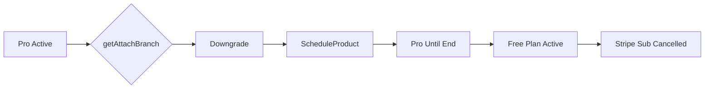

# Pro → Free (Cancellation)

Moving from a paid plan to free is essentially a cancellation with a fallback to the free tier. This is also scheduled to period end like other downgrades.



## Step 1: Detecting Free Product

The system recognizes a free product target:

```typescript
// server/src/internal/products/productUtils.ts:171-188
export const isFreeProduct = (prices: Price[]) => {
    if (prices.length === 0) {
        return true;  // No prices = free
    }

    let totalPrice = 0;
    for (const price of prices) {
        totalPrice += price.config!.amount;
    }
    return totalPrice === 0;  // $0 total = free
};
```

## Step 2: Branch Determination

System identifies this as a downgrade:

```typescript
// server/src/internal/customers/attach/attachUtils/getAttachBranch.ts
const isUpgrade = isProductUpgrade({
    prices1: proPrices,   // Pro: $50/month
    prices2: freePrices,  // Free: $0
});

// isProductUpgrade returns false (paid to free is never upgrade)
return AttachBranch.Downgrade;
```

## Step 3: Scheduling the Transition

The free plan is scheduled like any downgrade:

```typescript
// handleScheduleFunction2
export const handleScheduleFunction2 = async ({ attachParams }) => {
    const curSub = await paramsToCurSub({ attachParams });

    // Schedule cancellation at period end
    if (isFreeProduct(newProduct.prices)) {
        // Cancel Stripe subscription at period end
        await stripeCli.subscriptions.update(curSub.id, {
            cancel_at_period_end: true,
            cancellation_details: {
                comment: 'downgrade_to_free',
            }
        });

        // Create free product scheduled entry
        await createFullCusProduct({
            product: freeProduct,
            status: CusProductStatus.Scheduled,
            scheduled_date: curSub.current_period_end * 1000,
        });
    }
};
```

## Step 4: Stripe Subscription Handling

### Option A: Simple Cancellation
```typescript
// Just cancel the subscription
const updatedSub = await stripeCli.subscriptions.update(subId, {
    cancel_at_period_end: true,
    metadata: {
        downgrade_to: 'free',
        original_product: 'pro'
    }
});
```

### Option B: Subscription Schedule (for complex scenarios)
```typescript
// Use schedule if there are add-ons or complex billing
const schedule = await stripeCli.subscriptionSchedules.create({
    from_subscription: subId,
    phases: [
        {
            // Continue Pro until end
            items: [{ price: 'price_pro' }],
            end_date: periodEnd,
        },
        // No phase 2 - subscription ends
    ],
    end_behavior: 'cancel',
});
```

## Customer Experience

### Immediate Response
```json
{
    "status": "scheduled",
    "message": "You'll be moved to the Free plan on Nov 1, 2024",
    "current_plan": {
        "name": "Pro",
        "price": 50,
        "valid_until": "2024-11-01"
    },
    "future_plan": {
        "name": "Free",
        "price": 0,
        "starts": "2024-11-01",
        "limits": {
            "users": 1,
            "projects": 3,
            "storage": "1GB"
        }
    }
}
```

### What Happens at Transition

1. **Before Period End (Oct 31, 11:59 PM)**:
   - Full Pro access
   - All features available
   - Can still cancel downgrade

2. **At Period End (Nov 1, 12:00 AM)**:
   - Stripe subscription cancelled
   - Pro features deactivated
   - Free plan activated
   - Usage limits enforced

3. **After Transition**:
   - No more charges
   - Limited to free tier features
   - Data preserved (usually)
   - Can upgrade anytime

## Database State

```typescript
// During scheduled period
customer_products = [
    {
        product: "pro",
        status: "active",
        canceled_at: "2024-11-01",
        subscription_ids: ["sub_123"],
    },
    {
        product: "free",
        status: "scheduled",
        scheduled_date: "2024-11-01",
        subscription_ids: [],  // No Stripe subscription for free
    }
];

// After transition
customer_products = [
    {
        product: "pro",
        status: "expired",
        ended_at: "2024-11-01",
    },
    {
        product: "free",
        status: "active",
        started_at: "2024-11-01",
    }
];
```

## Special Considerations

### Data and Limits

```typescript
// Check if downgrade is possible with current usage
const canDowngrade = async (customer: Customer) => {
    const usage = await getCustomerUsage(customer.id);
    const freeLimits = FREE_PLAN_LIMITS;

    if (usage.projects > freeLimits.projects) {
        return {
            allowed: false,
            reason: `You have ${usage.projects} projects. Free plan allows ${freeLimits.projects}.`,
            action_required: 'Delete projects before downgrading'
        };
    }

    return { allowed: true };
};
```

### Retention Strategies

System can trigger retention flows:

```typescript
// Before processing downgrade
if (config.enableRetention) {
    // Offer discount
    const discount = await getRetentionOffer(customer);
    if (discount) {
        return {
            type: 'retention_offer',
            discount: discount,
            message: 'Stay on Pro for 50% off for 3 months'
        };
    }
}
```

### Win-back Campaigns

After downgrade to free:

```typescript
// Track for win-back
await trackEvent({
    type: 'customer_downgraded_to_free',
    customer_id: customer.id,
    previous_plan: 'pro',
    mrr_lost: 50,
    reason: attachParams.reason,  // If collected
});

// Schedule win-back emails
await scheduleWinbackCampaign({
    customer_id: customer.id,
    previous_plan: 'pro',
    intervals: [7, 30, 60],  // Days after downgrade
});
```

## Comparison with Cancellation

| Aspect | Downgrade to Free | Full Cancellation |
|--------|------------------|-------------------|
| Account Status | Active (free tier) | Closed/Suspended |
| Data | Preserved | May be deleted |
| Re-activation | Easy upgrade | Full re-signup |
| Stripe Customer | Retained | May be deleted |
| Marketing | Can email freely | Limited contact |

## Edge Cases

### Add-ons with Free Plan

```typescript
// If customer has add-ons
if (hasAddOns(customer)) {
    // Option 1: Cancel add-ons too
    await cancelAllAddOns(customer);

    // Option 2: Keep compatible add-ons
    const compatibleAddOns = getCompatibleAddOns('free', currentAddOns);
    // Only cancel incompatible ones
}
```

### Usage-Based Billing

```typescript
// Ensure final usage is billed
if (hasUsageBasedPricing(currentProduct)) {
    // Create final usage invoice
    await createFinalUsageInvoice({
        customer,
        end_date: periodEnd,
        include_unbilled: true,
    });
}
```

### Immediate Downgrade Request

```typescript
// Some cases might allow immediate move to free
if (config.allowImmediateToFree || customer.hardship_request) {
    // Process refund for unused time
    const refund = calculateProratedRefund(subscription);

    // Immediate transition
    await cancelSubscriptionImmediately(subscription);
    await activateFreeProduct(customer);

    // Issue refund
    await processRefund(refund);
}
```

## Re-upgrade Flow

Making it easy to come back:

```typescript
// When free customer upgrades again
if (previouslyPaidCustomer(customer)) {
    // Restore previous preferences
    // Offer welcome back discount
    // Skip onboarding
    // Restore data if applicable
}
```

## Analytics and Metrics

Track downgrade patterns:

```sql
-- Downgrade reasons
SELECT
    downgrade_reason,
    COUNT(*) as count,
    AVG(previous_mrr) as avg_mrr_lost
FROM downgrades
WHERE new_product = 'free'
GROUP BY downgrade_reason;

-- Time to downgrade
SELECT
    AVG(DATEDIFF(downgrade_date, signup_date)) as avg_days_to_downgrade
FROM customers
WHERE current_plan = 'free'
AND previous_plan IS NOT NULL;
```