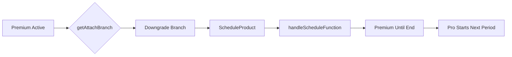

# Premium → Pro Downgrade

Downgrades are handled differently from upgrades - they're scheduled for the end of the billing period to prevent immediate revenue loss and ensure customers get what they paid for.



## Step 1: Branch Determination

The system determines this is a downgrade:

```typescript
// server/src/internal/customers/attach/attachUtils/getAttachBranch.ts:254-291
const getChangeProductBranch = async ({ attachParams }) => {
    const curPrices = cusProductToPrices({ cusProduct: curMainProduct! });
    const newPrices = attachParams.prices;

    const isUpgrade = isProductUpgrade({
        prices1: curPrices,  // Premium prices
        prices2: newPrices,  // Pro prices
    });

    if (isUpgrade) {
        return AttachBranch.Upgrade;
    }

    return AttachBranch.Downgrade;  // ← Our case
};
```

## Step 2: Function Selection

For downgrades, always schedule:

```typescript
// server/src/internal/customers/attach/attachUtils/getAttachFunction.ts:89-91
if (branch === AttachBranch.Downgrade) {
    return AttachFunction.ScheduleProduct;
}
```

## Step 3: The Scheduling Process

Instead of immediate change, the system creates a scheduled product:

```typescript
// server/src/internal/customers/attach/attachFunctions/scheduleFlow/handleScheduleFunction2.ts
export const handleScheduleFunction2 = async ({ req, res, attachParams, config }) => {
    const curCusProduct = attachParamsToCurCusProduct({ attachParams });
    const curSub = await paramsToCurSub({ attachParams });

    // Calculate when current period ends
    const periodEnd = curSub.current_period_end;

    // Create scheduled product in database
    await createFullCusProduct({
        db: req.db,
        attachParams,
        status: CusProductStatus.Scheduled,
        scheduled_date: periodEnd * 1000,  // Convert to milliseconds
    });

    // Create Stripe subscription schedule
    await createSubSchedule({
        attachParams,
        sub: curSub,
        phases: [
            {
                // Current phase - Premium continues
                items: currentItems,
                end_date: periodEnd,
            },
            {
                // Future phase - Pro starts
                items: newProItems,
                start_date: periodEnd,
            }
        ],
    });
};
```

## Step 4: Stripe Subscription Schedule

Stripe handles the transition automatically:

```typescript
// Creating the schedule
const schedule = await stripeCli.subscriptionSchedules.create({
    from_subscription: curSub.id,
    phases: [
        {
            // Phase 1: Continue Premium until period end
            items: [
                { price: 'price_premium', quantity: 1 }
            ],
            end_date: currentPeriodEnd,
        },
        {
            // Phase 2: Switch to Pro
            items: [
                { price: 'price_pro', quantity: 1 }
            ],
            iterations: null,  // Continue indefinitely
        }
    ],
});
```

## Customer Experience

### Timeline Example

**October 1**: Customer on Premium ($100/month)
**October 15**: Requests downgrade to Pro ($50/month)
**October 15-31**: Continues using Premium (already paid)
**November 1**: Automatically switches to Pro
**November 1**: Charged $50 for Pro

### What the Customer Sees

```typescript
// Immediate feedback
{
    message: "Your plan will change to Pro on November 1, 2024",
    current_plan: "Premium",
    future_plan: "Pro",
    change_date: "2024-11-01",
    next_charge: {
        amount: 50,
        date: "2024-11-01"
    }
}
```

## Database State During Schedule

The system maintains both current and scheduled products:

```typescript
// customer_products table
[
    {
        id: "cp_123",
        product_id: "premium",
        status: "active",
        canceled_at: periodEnd,  // Marked for cancellation
    },
    {
        id: "cp_456",
        product_id: "pro",
        status: "scheduled",
        scheduled_date: periodEnd,  // When it becomes active
    }
]
```

## Cancelling a Scheduled Downgrade

Customers can cancel the scheduled change:

```typescript
// Cancel the downgrade
if (scheduledProduct && action === 'cancel_downgrade') {
    // Delete scheduled product
    await CusProductService.delete({
        cusProductId: scheduledProduct.id,
    });

    // Remove subscription schedule
    await stripeCli.subscriptionSchedules.release(scheduleId);

    // Update current product
    await CusProductService.update({
        cusProductId: currentProduct.id,
        updates: {
            canceled_at: null,  // Remove cancellation
        },
    });
}
```

## Why Schedule Downgrades?

### Business Reasons
1. **Revenue Protection**: Get full value for current period
2. **Reduced Churn**: Time to reconsider decision
3. **Fair Usage**: Customer paid for Premium features
4. **Accounting Simplicity**: No complex refunds

### Technical Benefits
1. **No Proration Needed**: Clean billing boundaries
2. **Simpler Implementation**: No immediate changes
3. **Predictable Cash Flow**: Known revenue until period end
4. **Stripe Alignment**: Uses native scheduling features

## Edge Cases

### Annual Downgrades

For yearly plans, the wait can be long:

```typescript
if (billingInterval === BillingInterval.Year) {
    // Could be up to 12 months wait
    // Consider offering immediate downgrade with proration
    if (config.allowImmediateDowngrade) {
        return AttachFunction.UpgradeDiffInterval;  // Treat as immediate
    }
}
```

### Multiple Downgrades

Customer can change their mind:

```typescript
// Premium → Pro (scheduled)
// Then Premium → Basic (replaces previous schedule)
if (existingScheduledProduct) {
    await CusProductService.delete({
        cusProductId: existingScheduledProduct.id,
    });
}
// Create new schedule for Basic
```

### Usage-Based Downgrades

Special handling for usage components:

```typescript
if (hasUsageComponents(currentProduct)) {
    // Stop usage tracking at period end
    // Ensure final usage bill is generated
    // Then switch to new product
}
```

## Comparison with Upgrades

| Aspect | Upgrade (Pro → Premium) | Downgrade (Premium → Pro) |
|--------|------------------------|--------------------------|
| Timing | Immediate | End of period |
| Billing | Prorated charge | No proration |
| Access | Instant Premium access | Premium until switch |
| Revenue | Immediate increase | Delayed decrease |
| Complexity | Complex proration | Simple scheduling |

## Communication

### Email Notifications

```typescript
// Immediate confirmation
await sendEmail({
    template: 'downgrade_scheduled',
    data: {
        current_plan: 'Premium',
        future_plan: 'Pro',
        change_date: periodEnd,
        savings: 50,  // Monthly savings
    }
});

// Reminder before change
await scheduleEmail({
    template: 'downgrade_reminder',
    send_date: periodEnd - 3 * DAY,  // 3 days before
});
```

### In-App Messaging

Show scheduled change prominently:
- Dashboard banner
- Account settings indicator
- Billing page timeline
- Cancel option visible