# Complete Attach Router Flow

This diagram shows every possible subscription change scenario handled by the attach router system.

```mermaid
graph TD
    Start[Customer Request]
    Start --> CheckProducts{Check<br/>Existing<br/>Products}

    CheckProducts --> NoProduct[No Products]
    CheckProducts --> FreeProduct[Has Free]
    CheckProducts --> TrialProduct[Has Trial]
    CheckProducts --> PaidProduct[Has Paid]

    %% From Nothing - vertical flow
    NoProduct --> NewOptions[New Customer Options]
    NewOptions --> NewFree[Free<br/>Branch: New]
    NewOptions --> NewPaid[Paid<br/>Branch: New<br/>Func: AddProduct]
    NewOptions --> NewTrial[Trial<br/>Branch: New]

    %% From Free - vertical flow
    FreeProduct --> FreeOptions[Free Upgrade Paths]
    FreeOptions --> FreeToPaid[Free → Paid<br/>Branch: MainIsFree<br/>No cancel needed]
    FreeOptions --> FreeToTrial[Free → Trial<br/>Branch: MainIsFree]
    FreeOptions --> FreeAddOn[Add Add-on<br/>Branch: AddOn]

    %% From Trial - vertical flow
    TrialProduct --> TrialOptions[Trial Conversions]
    TrialOptions --> TrialToPaid[Trial → Paid<br/>Branch: MainIsTrial<br/>Cancel trial first]
    TrialOptions --> TrialToTrial[Trial → Trial<br/>Branch: MainIsTrial]
    TrialOptions --> TrialToFree[Trial → Free<br/>Branch: MainIsTrial]

    %% From Paid - main branches
    PaidProduct --> PaidChanges[Paid Plan Changes]

    PaidChanges --> Upgrades[Upgrades]
    PaidChanges --> Downgrades[Downgrades]
    PaidChanges --> Additions[Additions]
    PaidChanges --> Special[Special Cases]

    %% Upgrades section
    Upgrades --> SameInt[Same Interval<br/>Pro M → Premium M<br/>Func: UpgradeSame<br/>Immediate]
    Upgrades --> DiffInt[Diff Interval<br/>Pro M → Premium Y<br/>Func: UpgradeDiff<br/>Proration]
    Upgrades --> MultiInt[Multi-interval<br/>Pro M+Y → Premium<br/>Complex billing]

    %% Downgrades section
    Downgrades --> ScheduleDown[Schedule Down<br/>Premium → Pro<br/>Func: Schedule<br/>At period end]
    Downgrades --> DownToFree[Down to Free<br/>Pro → Free<br/>Schedule cancel]

    %% Additions section
    Additions --> AddRecurring[Recurring Add-on<br/>Branch: AddOn]
    Additions --> AddUsage[Usage Add-on<br/>Pay per use]
    Additions --> AddOneTime[One-time<br/>Branch: OneOff<br/>Immediate charge]

    AddRecurring --> RecTypes[Analytics<br/>Support<br/>Storage]
    AddOneTime --> OneTypes[Training<br/>Setup<br/>Migration]

    %% Special Cases section
    Special --> MultiAttach[Multi-attach<br/>Branch: MultiAttach]
    Special --> EntityMgmt[Entity Mgmt]
    Special --> RenewCancel[Renew Cancelled<br/>Branch: Renew]

    MultiAttach --> MultiNew[New Multi<br/>Multiple at once]
    MultiAttach --> MultiUpdate[Update Multi<br/>Modify existing]

    EntityMgmt --> EntCases[Per-Entity Plans]
    EntCases --> Ent1[Entity 1: Pro<br/>Entity 2: Free]
    EntCases --> Ent2[Entity 1: Pro<br/>Entity 2: Premium]

    %% Final states
    NewFree --> Active[Active]
    NewPaid --> Active
    NewTrial --> Active
    FreeToPaid --> Active
    TrialToPaid --> Active
    SameInt --> Active
    DiffInt --> Active
    MultiInt --> Active
    ScheduleDown --> Scheduled[Scheduled]
    DownToFree --> Scheduled
    AddRecurring --> Active
    AddOneTime --> Active
    RenewCancel --> Active
    MultiNew --> Active
    MultiUpdate --> Active

    %% Styling
    style Start fill:#e1f5e1
    style Active fill:#90EE90
    style Scheduled fill:#FFE4B5
    style TrialProduct fill:#FFB6C1
    style FreeProduct fill:#E0E0E0
    style PaidProduct fill:#87CEEB
    style Upgrades fill:#B0E0B0
    style Downgrades fill:#FFB0B0
    style Additions fill:#B0B0FF
    style Special fill:#FFE0B0
```

## Key Decision Points

1. **Current Product Status** - Determines available paths
2. **Product Type** - Main vs Add-on vs One-time
3. **Pricing Comparison** - Upgrade vs Downgrade logic
4. **Billing Intervals** - Same vs Different handling
5. **Entity Context** - Multi-tenant considerations
6. **Payment Method** - Checkout vs Direct attachment

## Branch → Function Mapping

| Branch | Function | When Used |
|--------|----------|-----------|
| New | AddProduct/CreateCheckout | No existing product |
| MainIsFree | AddProduct | Upgrading from free |
| MainIsTrial | AddProduct (with cancel) | Upgrading from trial |
| Upgrade | UpgradeSame/DiffInterval | Paid to higher paid |
| Downgrade | ScheduleProduct | Paid to lower paid |
| MultiAttach | MultiAttach | Complex multi-product |
| OneOff | OneOff | One-time charges |
| AddOn | AddProduct | Adding supplementary products |
| Renew | Renew | Reactivating cancelled |