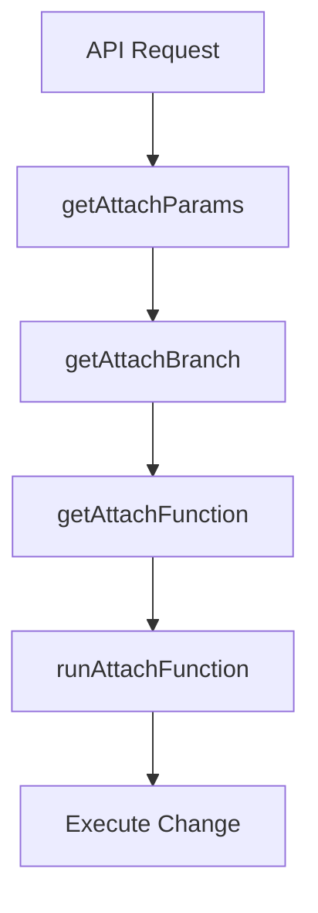

# Attach Router System

The Attach Router is the core billing engine in Autumn that handles all subscription changes, upgrades, downgrades, and product attachments. This sophisticated system orchestrates complex billing scenarios with multiple pricing models, billing intervals, and customer states.

## Overview

When a customer changes their subscription (attaching a new product), the system goes through a carefully orchestrated flow:

## The Three-Layer Architecture

### 1. AttachBranch (What Type of Change?)
The system first determines what type of subscription change is happening:
- `New` - Brand new subscription
- `Upgrade` - Moving to a higher-tier plan
- `Downgrade` - Moving to a lower-tier plan
- `MainIsFree` - Upgrading from a free plan
- `MainIsTrial` - Upgrading from a trial
- `MultiAttach` - Complex multi-product scenarios
- `Renew` - Reactivating a cancelled subscription

### 2. AttachFunction (How to Handle It?)
Based on the branch, it selects the appropriate function:
- `AddProduct` - Add a new product subscription
- `UpgradeSameInterval` - Upgrade within same billing cycle
- `UpgradeDiffInterval` - Upgrade with different billing cycle
- `ScheduleProduct` - Schedule future changes (downgrades)
- `CreateCheckout` - Redirect to Stripe checkout
- `MultiAttach` - Handle multiple products at once

### 3. Handler Functions (Execute the Change)
Finally, specific handlers execute the actual changes:
- `handleAddProduct` - Creates new subscriptions
- `handleUpgradeFlow` - Manages upgrades with proration
- `handleScheduleFunction` - Schedules future changes
- `handleMultiAttachFlow` - Orchestrates multi-product changes

## Key Concepts

### Product Hierarchy
- **Main Product**: The primary subscription for a customer (only one active at a time)
- **Add-on Product**: Additional products that supplement the main product
- **Scheduled Product**: A product change scheduled for the future

### Customer Product States
- **Active**: Currently active and billing
- **Trial**: In a trial period
- **Cancelled**: Marked for cancellation at period end
- **Expired**: No longer active
- **Scheduled**: Will become active in the future

### Pricing Models
- **Fixed Cycle**: Regular recurring charges (monthly, yearly)
- **Usage in Advance**: Prepaid usage blocks
- **Usage in Arrears**: Pay-as-you-go, billed after usage
- **One-off**: Single-time charges

## File Structure

Key files in the system:

- **Entry Points**:
  - `server/src/internal/customers/attach/attachRouter.ts` - Main router and error handling
  - `server/src/internal/customers/attach/handleAttach.ts` - Primary attach handler

- **Decision Logic**:
  - `attachUtils/getAttachBranch.ts` - Determines the type of change
  - `attachUtils/getAttachFunction.ts` - Maps branch to execution function
  - `attachUtils/attachParams/getAttachParams.ts` - Processes request parameters

- **Execution Handlers**:
  - `attachFunctions/addProductFlow/` - New product additions
  - `attachFunctions/upgradeFlow/` - Upgrade scenarios
  - `attachFunctions/scheduleFlow/` - Scheduled changes
  - `attachFunctions/multiAttach/` - Multi-product operations

## How Products Are Compared

### Checking Existing Products
The system uses `getExistingCusProducts` to find three key products:

1. **curMainProduct**: The current main subscription in the same product group
2. **curSameProduct**: An exact match of the product being attached
3. **curScheduledProduct**: Any scheduled future product in the same group

### Determining Upgrades vs Downgrades
The `isProductUpgrade` function compares products by:
1. Free vs Paid (free → paid is always an upgrade)
2. Total price comparison (normalized by billing interval)
3. Billing interval comparison (monthly < quarterly < yearly)

## Common Scenarios

### Simple Transitions
- [Free → Pro](/docs/attach/upgrade-cases/free-to-paid) - Basic upgrade from free tier
- [Pro → Premium](/docs/attach/upgrade-cases/pro-to-premium) - Standard tier upgrade
- [Premium → Pro](/docs/attach/downgrade-cases/premium-to-pro) - Downgrade scenario

### Complex Billing
- [Multi-interval Upgrades](/docs/attach/upgrade-cases/multi-interval-upgrades) - Products with multiple billing components
- [Trial Conversions](/docs/attach/upgrade-cases/trial-upgrades) - Converting trials to paid plans

### Multi-Product & Entities
- [Multi-product Flows](/docs/attach/multi-product/multi-product-flows) - Managing multiple products simultaneously
- [Entity Management](/docs/attach/multi-product/entity-management) - Different products for different entities
- [Add-ons](/docs/attach/special-cases/one-time-addons) - One-time and recurring add-ons

## Error Handling

The system includes comprehensive error checking:

- **Prepaid Quantity Validation**: Ensures valid quantities for usage-based pricing
- **Public Attach Restrictions**: Prevents certain upgrades in public contexts
- **Product Conflict Detection**: Prevents duplicate product attachments
- **Payment Method Requirements**: Enforces payment setup when needed

## Stripe Integration

All billing operations ultimately sync with Stripe:

- Creates/updates Stripe subscriptions
- Manages subscription items for multi-component pricing
- Handles proration automatically
- Syncs customer and product data

## Navigation

Explore specific scenarios:

### Upgrade Cases
- [Free to Paid Upgrades](/docs/attach/upgrade-cases/free-to-paid)
- [Pro to Premium Upgrades](/docs/attach/upgrade-cases/pro-to-premium)
- [Multi-interval Upgrades](/docs/attach/upgrade-cases/multi-interval-upgrades)
- [Trial Upgrades](/docs/attach/upgrade-cases/trial-upgrades)

### Downgrade Cases
- [Premium to Pro Downgrades](/docs/attach/downgrade-cases/premium-to-pro)
- [Paid to Free Downgrades](/docs/attach/downgrade-cases/paid-to-free)

### Multi-Product Scenarios
- [Multi-product Flows](/docs/attach/multi-product/multi-product-flows)
- [Entity Management](/docs/attach/multi-product/entity-management)
- [Multi-attach Operations](/docs/attach/multi-product/multi-attach)

### Special Cases
- [One-time Add-ons](/docs/attach/special-cases/one-time-addons)
- [Recurring Add-ons](/docs/attach/special-cases/recurring-addons)