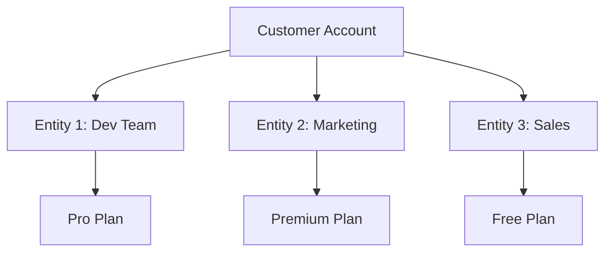

# Entity Management

Entities allow a single customer to have different products for different sub-accounts, teams, or projects. This enables sophisticated multi-tenant billing scenarios.



## Understanding Entities

Entities are sub-divisions within a customer account:

```typescript
// Customer structure with entities
customer = {
    id: "cus_123",
    name: "Acme Corp",
    entities: [
        { id: "ent_dev", name: "Development Team", internal_id: "int_1" },
        { id: "ent_mkt", name: "Marketing", internal_id: "int_2" },
        { id: "ent_sls", name: "Sales", internal_id: "int_3" }
    ]
}
```

## Entity-Specific Attach

When attaching products with entities:

```typescript
// Attach request with entity
{
    customer_id: "cus_123",
    entity_id: "ent_dev",  // ← Specifies which entity
    product_id: "premium"
}
```

## Step 1: Entity Resolution

The system resolves the entity:

```typescript
// server/src/internal/customers/attach/attachUtils/attachParams/getAttachParams.ts:30-31
const entityId = attachBody.entity_id;
const internalEntityId = entityId ? customer.entity?.internal_id : undefined;
```

## Step 2: Finding Entity-Specific Products

Products are matched to entities:

```typescript
// server/src/internal/customers/cusProducts/cusProductUtils/getExistingCusProducts.ts:36-38
const sameEntity = internalEntityId
    ? cp.internal_entity_id === internalEntityId
    : nullish(cp.internal_entity_id);

// Only returns products for the specific entity
```

## Case 1: Entity 1 Pro → Entity 2 Free → Pro

Different entities can have different upgrade paths:

### Initial State
```typescript
// Entity 1 (Dev Team): Has Pro
// Entity 2 (Marketing): Has Free
cusProducts = [
    {
        product: "pro",
        internal_entity_id: "int_1",  // Dev Team
        status: "active"
    },
    {
        product: "free",
        internal_entity_id: "int_2",  // Marketing
        status: "active"
    }
]
```

### Upgrade Entity 2 to Pro
```typescript
// Request
{
    customer_id: "cus_123",
    entity_id: "ent_mkt",  // Marketing entity
    product_id: "pro"
}

// Processing
const { curMainProduct } = getExistingCusProducts({
    product: proProduct,
    cusProducts: customer.customer_products,
    internalEntityId: "int_2"  // Only looks at Marketing's products
});

// curMainProduct = free (Marketing's current product)
// Not affected by Dev Team's Pro subscription
```

### Result
```typescript
// Both entities now have Pro, independently
cusProducts = [
    {
        product: "pro",
        internal_entity_id: "int_1",  // Dev Team Pro
        subscription_ids: ["sub_dev_pro"]
    },
    {
        product: "pro",
        internal_entity_id: "int_2",  // Marketing Pro (newly upgraded)
        subscription_ids: ["sub_mkt_pro"]
    }
]
```

## Case 2: Entity 1 Pro, Entity 2 Pro → Entity 2 Premium

Upgrading one entity doesn't affect others:

### Initial State
```typescript
// Both entities have Pro
cusProducts = [
    { product: "pro", internal_entity_id: "int_1" },
    { product: "pro", internal_entity_id: "int_2" }
]
```

### Upgrade Entity 2
```typescript
// Request
{
    entity_id: "ent_2",
    product_id: "premium"
}

// System checks
const isUpgrade = isProductUpgrade({
    prices1: entity2ProPrices,   // Entity 2's current Pro
    prices2: premiumPrices        // Target Premium
});
// Returns: AttachBranch.Upgrade

// Only Entity 2's subscription is modified
```

### Result
```typescript
cusProducts = [
    { product: "pro", internal_entity_id: "int_1" },     // Unchanged
    { product: "premium", internal_entity_id: "int_2" }  // Upgraded
]
```

## Case 3: Entity 1 Pro, Entity 2 Pro → Entity 2 Free

Downgrading one entity:

### The Downgrade Process
```typescript
// Only Entity 2 is scheduled for downgrade
if (branch === AttachBranch.Downgrade) {
    // Schedule downgrade for Entity 2 only
    await createFullCusProduct({
        product: freeProduct,
        internal_entity_id: "int_2",
        status: CusProductStatus.Scheduled,
        scheduled_date: entity2PeriodEnd
    });

    // Entity 1 continues on Pro unaffected
}
```

### Database State During Schedule
```typescript
cusProducts = [
    {
        product: "pro",
        internal_entity_id: "int_1",
        status: "active"  // Continues normally
    },
    {
        product: "pro",
        internal_entity_id: "int_2",
        status: "active",
        canceled_at: periodEnd  // Scheduled for cancellation
    },
    {
        product: "free",
        internal_entity_id: "int_2",
        status: "scheduled"  // Will activate at periodEnd
    }
]
```

## Stripe Subscription Management

### Separate Subscriptions per Entity
```typescript
// Each entity gets its own Stripe subscription
stripeSubscriptions = [
    {
        id: "sub_ent1_pro",
        metadata: { entity_id: "ent_1" },
        items: [{ price: "price_pro" }]
    },
    {
        id: "sub_ent2_premium",
        metadata: { entity_id: "ent_2" },
        items: [{ price: "price_premium" }]
    }
]
```

### Consolidated Billing Option
```typescript
// Or use one subscription with metadata
stripeSubscription = {
    id: "sub_main",
    items: [
        {
            price: "price_pro",
            quantity: 1,
            metadata: { entity_id: "ent_1" }
        },
        {
            price: "price_premium",
            quantity: 1,
            metadata: { entity_id: "ent_2" }
        }
    ]
}
```

## Billing Aggregation

### Separate Invoices
```typescript
// Each entity gets its own invoice
invoices = [
    {
        entity: "Development",
        items: [{ description: "Pro Plan", amount: 50 }],
        total: 50
    },
    {
        entity: "Marketing",
        items: [{ description: "Premium Plan", amount: 100 }],
        total: 100
    }
]
```

### Consolidated Invoice
```typescript
// Single invoice with breakdown
invoice = {
    customer: "Acme Corp",
    line_items: [
        {
            entity: "Development",
            product: "Pro Plan",
            amount: 50
        },
        {
            entity: "Marketing",
            product: "Premium Plan",
            amount: 100
        }
    ],
    total: 150
}
```

## Access Control

Entities can have different permissions:

```typescript
// Check entity access before attach
const canAttachProduct = async (userId: string, entityId: string) => {
    const userRole = await getUserEntityRole(userId, entityId);

    return userRole === 'admin' || userRole === 'billing_admin';
};

// Entity-specific feature flags
const getEntityFeatures = (entityId: string, product: Product) => {
    return {
        ...product.features,
        entity_specific: getEntityOverrides(entityId)
    };
};
```

## Usage Tracking

Usage is tracked per entity:

```typescript
// Report usage for specific entity
await reportUsage({
    customer_id: "cus_123",
    entity_id: "ent_dev",
    feature: "api_calls",
    quantity: 1000,
    timestamp: Date.now()
});

// Aggregate for billing
const totalUsage = await aggregateUsage({
    customer_id: "cus_123",
    group_by: "entity_id"
});
```

## Special Considerations

### Entity Limits
```typescript
// Products may have entity limits
const validateEntityLimit = (customer: Customer, product: Product) => {
    const activeEntities = customer.entities.filter(e =>
        e.product_id === product.id
    ).length;

    if (activeEntities >= product.max_entities) {
        throw new Error(`Product ${product.name} limited to ${product.max_entities} entities`);
    }
};
```

### Cross-Entity Upgrades
```typescript
// Bulk operations across entities
const bulkUpgrade = async (customer: Customer, targetProduct: Product) => {
    const results = [];

    for (const entity of customer.entities) {
        try {
            const result = await attachProduct({
                customer_id: customer.id,
                entity_id: entity.id,
                product_id: targetProduct.id
            });
            results.push({ entity: entity.id, success: true });
        } catch (error) {
            results.push({ entity: entity.id, success: false, error });
        }
    }

    return results;
};
```

### Entity Deletion
```typescript
// When entity is deleted, handle subscriptions
const deleteEntity = async (entityId: string) => {
    // Cancel entity-specific subscriptions
    const entityProducts = await getEntityProducts(entityId);

    for (const product of entityProducts) {
        if (product.subscription_ids?.length > 0) {
            await cancelSubscriptions(product.subscription_ids);
        }
    }

    // Mark products as ended
    await markProductsEnded(entityProducts);
};
```

## Best Practices

1. **Clear Entity Identification**: Always show which entity is being modified
2. **Isolated Billing**: Keep entity subscriptions separate when possible
3. **Audit Trails**: Track which user modified which entity's subscription
4. **Bulk Operations**: Provide tools for managing multiple entities
5. **Usage Separation**: Track and display usage per entity