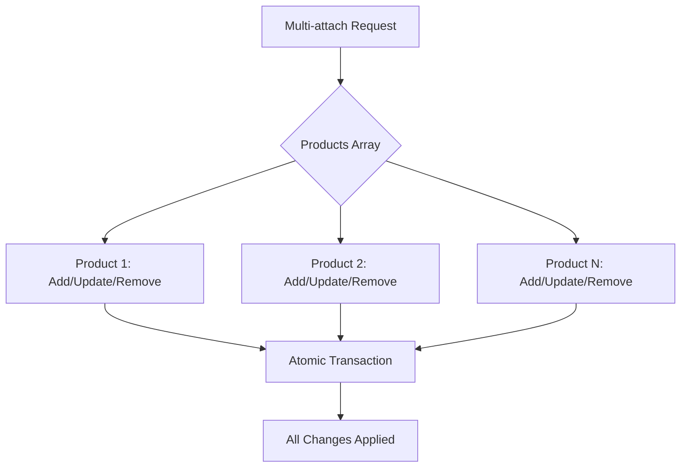

# Multi-attach Operations

Multi-attach is the most sophisticated operation in the attach router, allowing complex product combinations and updates in a single atomic operation.



## Request Structure

Multi-attach uses a products array with operations:

```typescript
// Multi-attach request structure
{
    customer_id: "cus_123",
    products: [
        {
            product_id: "pro",
            action: "add",
            options: { quantity: 1 }
        },
        {
            product_id: "analytics",
            action: "add",
            options: { quantity: 100 }
        },
        {
            product_id: "support",
            action: "remove"
        }
    ]
}
```

## Branch Determination

System detects multi-attach requests:

```typescript
// server/src/internal/customers/attach/attachUtils/getAttachBranch.ts:304-312
if (notNullish(attachBody.products)) {
    const { subId } = await getCustomerSub({ attachParams, onlySubId: true });

    if (subId) {
        return AttachBranch.MultiAttachUpdate;  // Has existing subscription
    }
    return AttachBranch.MultiAttach;  // New subscription
}
```

## The Multi-attach Handler

```typescript
// server/src/internal/customers/attach/attachFunctions/multiAttach/handleMultiAttachFlow.ts
export const handleMultiAttachFlow = async ({
    req,
    res,
    attachParams,
    attachBody,
    branch,
    config,
}) => {
    const { products: productsList } = attachBody;

    // 1. Determine what to add and remove
    const { productsToAdd, productsToRemove } = await getAddAndRemoveProducts({
        attachParams,
        productsList,
    });

    // 2. Validate the operation
    await validateMultiAttach({
        productsToAdd,
        productsToRemove,
        existingProducts: attachParams.cusProducts,
    });

    // 3. Calculate subscription items
    const { addItemSet, removeItems } = await calculateSubscriptionChanges({
        productsToAdd,
        productsToRemove,
    });

    // 4. Update or create subscription
    if (branch === AttachBranch.MultiAttachUpdate) {
        await updateSubscriptionItems({
            sub: existingSub,
            addItemSet,
            removeItems,
        });
    } else {
        await createNewSubscription({
            attachParams,
            itemSet: addItemSet,
        });
    }

    // 5. Update database
    await updateCustomerProducts({
        productsToAdd,
        productsToRemove,
    });
};
```

## Determining Add/Remove Products

```typescript
// server/src/internal/customers/attach/attachFunctions/multiAttach/getAddAndRemoveProducts.ts
export const getAddAndRemoveProducts = async ({ attachParams, productsList }) => {
    const productsToAdd = [];
    const productsToRemove = [];

    for (const productSpec of productsList) {
        const product = await getProduct(productSpec.product_id);
        const existingCusProduct = findExistingProduct(product, attachParams.cusProducts);

        switch (productSpec.action) {
            case 'add':
                if (!existingCusProduct) {
                    productsToAdd.push(product);
                } else if (productSpec.options?.quantity !== existingCusProduct.quantity) {
                    // Update quantity
                    productsToAdd.push({
                        ...product,
                        updateQuantity: true,
                        oldQuantity: existingCusProduct.quantity,
                        newQuantity: productSpec.options.quantity,
                    });
                }
                break;

            case 'remove':
                if (existingCusProduct) {
                    productsToRemove.push(existingCusProduct);
                }
                break;

            case 'update':
                // Handle updates (quantity, options, etc.)
                if (existingCusProduct) {
                    productsToAdd.push({
                        ...product,
                        updating: true,
                        options: productSpec.options,
                    });
                }
                break;
        }
    }

    return { productsToAdd, productsToRemove };
};
```

## Complex Scenarios

### Scenario 1: Add Multiple Products at Once
```typescript
// Customer has nothing
// Adding: Pro + Analytics + Support
{
    products: [
        { product_id: "pro", action: "add" },
        { product_id: "analytics", action: "add", options: { quantity: 1000 } },
        { product_id: "support", action: "add" }
    ]
}

// Result: Single subscription with all three products
```

### Scenario 2: Swap Products
```typescript
// Customer has Pro + Old Analytics
// Changing to: Premium + New Analytics
{
    products: [
        { product_id: "pro", action: "remove" },
        { product_id: "premium", action: "add" },
        { product_id: "analytics_old", action: "remove" },
        { product_id: "analytics_new", action: "add" }
    ]
}

// Atomic swap - all changes happen together
```

### Scenario 3: Update Quantities
```typescript
// Customer has Usage-based products
// Updating prepaid quantities
{
    products: [
        {
            product_id: "api_calls",
            action: "update",
            options: { quantity: 10000 }  // Increase from 5000
        },
        {
            product_id: "storage",
            action: "update",
            options: { quantity: 500 }  // Decrease from 1000
        }
    ]
}
```

## Validation Rules

Multi-attach enforces strict validation:

```typescript
const validateMultiAttach = async ({ productsToAdd, productsToRemove, existingProducts }) => {
    // 1. Cannot have multiple main products
    const mainProducts = productsToAdd.filter(p => !p.is_add_on);
    const existingMain = existingProducts.find(p => !p.product.is_add_on && p.status === 'active');

    if (mainProducts.length > 1) {
        throw new Error("Cannot attach multiple main products");
    }

    if (mainProducts.length === 1 && existingMain && !productsToRemove.includes(existingMain)) {
        throw new Error("Cannot have two main products. Remove existing first.");
    }

    // 2. Check dependencies
    for (const product of productsToAdd) {
        if (product.requires) {
            const hasRequired = [...existingProducts, ...productsToAdd]
                .some(p => product.requires.includes(p.id));

            if (!hasRequired) {
                throw new Error(`${product.name} requires ${product.requires.join(', ')}`);
            }
        }
    }

    // 3. Check compatibility
    const allProducts = [
        ...existingProducts.filter(p => !productsToRemove.includes(p)),
        ...productsToAdd
    ];

    await checkProductCompatibility(allProducts);
};
```

## Stripe Subscription Update

The system generates optimal Stripe API calls:

```typescript
// Consolidate all changes into single update
const updateSubscriptionItems = async ({ sub, addItemSet, removeItems }) => {
    const updates = [];

    // Remove items
    for (const item of removeItems) {
        updates.push({
            id: item.id,
            deleted: true
        });
    }

    // Add new items
    for (const item of addItemSet.subItems) {
        updates.push({
            price: item.price,
            quantity: item.quantity,
            metadata: item.metadata
        });
    }

    // Single API call for all changes
    await stripeCli.subscriptions.update(sub.id, {
        items: updates,
        proration_behavior: 'create_prorations'
    });
};
```

## Special Cases

### Add-on Stacking
```typescript
// Pro + multiple add-ons
{
    products: [
        { product_id: "analytics_basic", action: "add" },
        { product_id: "analytics_advanced", action: "add" },
        { product_id: "support_email", action: "add" },
        { product_id: "support_phone", action: "add" }
    ]
}
// All add-ons stack on the main product
```

### One-time with Recurring
```typescript
// Mix of one-time and recurring
{
    products: [
        { product_id: "pro", action: "add" },           // Recurring
        { product_id: "setup", action: "add" },         // One-time
        { product_id: "training", action: "add" }       // One-time
    ]
}

// One-time charges process immediately
// Recurring starts normal billing cycle
```

### Partial Failures

Multi-attach is atomic - all or nothing:

```typescript
try {
    await db.transaction(async (tx) => {
        // All database operations in transaction
        for (const product of productsToAdd) {
            await addProduct(product, tx);
        }

        for (const product of productsToRemove) {
            await removeProduct(product, tx);
        }

        // Stripe update
        await updateStripeSubscription(changes);

        // If Stripe fails, transaction rolls back
    });
} catch (error) {
    // Nothing changed - atomic rollback
    throw new Error(`Multi-attach failed: ${error.message}`);
}
```

## Proration Handling

Complex proration for multiple changes:

```typescript
const calculateMultiAttachProration = (changes) => {
    let totalCredit = 0;
    let totalCharge = 0;

    // Credits for removed products
    for (const removed of changes.removals) {
        const unusedDays = getRemainingDays(removed);
        const dailyRate = removed.price / 30;
        totalCredit += unusedDays * dailyRate;
    }

    // Charges for added products
    for (const added of changes.additions) {
        const remainingDays = getRemainingDays(billingCycle);
        const dailyRate = added.price / 30;
        totalCharge += remainingDays * dailyRate;
    }

    return {
        credit: totalCredit,
        charge: totalCharge,
        net: totalCharge - totalCredit
    };
};
```

## Response Structure

Multi-attach returns comprehensive results:

```typescript
{
    success: true,
    changes: {
        added: [
            { product: "premium", status: "active" },
            { product: "analytics", status: "active" }
        ],
        removed: [
            { product: "pro", ended_at: "2024-10-15T10:00:00Z" }
        ],
        updated: [
            { product: "storage", old_quantity: 100, new_quantity: 500 }
        ]
    },
    billing: {
        immediate_charge: 45.50,
        next_invoice_amount: 150.00,
        next_invoice_date: "2024-11-01"
    },
    subscription: {
        id: "sub_123",
        status: "active",
        item_count: 4
    }
}
```

## Best Practices

1. **Validate Early**: Check all constraints before making changes
2. **Atomic Operations**: Use transactions for all-or-nothing
3. **Clear Feedback**: Show exactly what changed
4. **Proration Transparency**: Display all credits and charges
5. **Rollback Plan**: Ensure changes can be reverted if needed