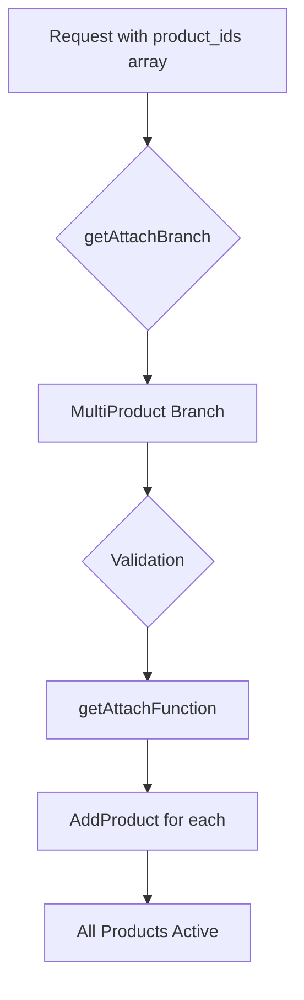

# Multi-product Flows

The attach router can handle multiple products being attached at once, useful for bundled offerings or complex product configurations.



## Request Structure

Multi-product requests use an array of product IDs:

```typescript
// Single product request
{
    "product_id": "pro",
    "customer_id": "cus_123"
}

// Multi-product request
{
    "product_ids": ["pro", "analytics", "support"],  // ← Multiple products
    "customer_id": "cus_123"
}
```

## Step 1: Branch Determination

The system detects multi-product requests:

```typescript
// server/src/internal/customers/attach/attachUtils/getAttachBranch.ts:318-321
if (notNullish(attachBody.product_ids)) {
    await handleMultiProductErrors({ attachParams });
    return AttachBranch.MultiProduct;
}
```

## Step 2: Multi-product Validation

Critical validation prevents conflicts:

```typescript
// server/src/internal/customers/attach/attachUtils/getAttachBranch.ts:31-82
const handleMultiProductErrors = async ({ attachParams }) => {
    const { products } = attachParams;

    // Check for one-off only (allowed)
    if (pricesOnlyOneOff(attachParams.prices)) {
        return true;
    }

    for (const product of products) {
        const { curMainProduct, curSameProduct, curScheduledProduct } =
            getExistingCusProducts({ product, cusProducts, internalEntityId });

        // 1. If product is add-on, allow attach
        if (product.is_add_on) {
            continue;
        }

        // 2. If same product exists, not allowed
        if (curSameProduct) {
            throw new RecaseError({
                message: `Product ${product.name} is already attached`,
                code: ErrCode.InvalidRequest,
            });
        }

        // 3. If existing paid main product, not allowed
        const curPaidProduct = curMainProduct &&
            !isFreeProduct(cusProductToPrices({ cusProduct: curMainProduct }));

        if (curPaidProduct) {
            throw new RecaseError({
                message: `Upgrade/downgrade to ${product.name} not allowed with multiple products`,
                code: ErrCode.InvalidRequest,
            });
        }

        // 4. If scheduled product exists, not allowed
        if (curScheduledProduct) {
            throw new RecaseError({
                message: `Can't attach multiple products when scheduled product exists`,
                code: ErrCode.InvalidRequest,
            });
        }
    }
};
```

## Step 3: Valid Multi-product Scenarios

### Scenario 1: Multiple Add-ons
```typescript
// Customer has Pro (main product)
// Attaching: Analytics Add-on + Support Add-on
{
    products: [
        { id: "analytics", is_add_on: true },
        { id: "support", is_add_on: true }
    ]
}
// ✅ Allowed - add-ons can stack
```

### Scenario 2: Free to Multiple Products
```typescript
// Customer has Free plan
// Attaching: Pro + Analytics Add-on
{
    products: [
        { id: "pro", is_add_on: false },       // Main product
        { id: "analytics", is_add_on: true }   // Add-on
    ]
}
// ✅ Allowed - upgrading from free
```

### Scenario 3: One-off Products
```typescript
// Customer has Pro
// Attaching: Training (one-time) + Setup (one-time)
{
    products: [
        { id: "training", prices: [{ interval: "one_off" }] },
        { id: "setup", prices: [{ interval: "one_off" }] }
    ]
}
// ✅ Allowed - one-off products don't conflict
```

## Step 4: Execution

Each product is processed:

```typescript
// handleAddProduct is called for each product
for (const product of products) {
    const productAttachParams = {
        ...attachParams,
        products: [product],  // Process one at a time
        prices: getProductPrices(product),
    };

    await createFullCusProduct({
        attachParams: productAttachParams,
        // Each product gets its own database entry
    });
}
```

## Invalid Scenarios

### Cannot: Multiple Main Products
```typescript
// Customer has Pro
// Trying to attach: Premium (another main product)
{
    products: [
        { id: "pro", is_add_on: false },
        { id: "premium", is_add_on: false }  // ❌ Two main products
    ]
}
// Throws: "Upgrade/downgrade not allowed with multiple products"
```

### Cannot: Attach When Scheduled Exists
```typescript
// Customer has Pro, scheduled downgrade to Basic
// Trying to attach: Analytics add-on
{
    current: "pro",
    scheduled: "basic",
    attaching: ["analytics"]
}
// Throws: "Can't attach multiple products when scheduled product exists"
```

## Stripe Subscription Structure

Multi-product creates multiple subscription items:

```typescript
// Result of multi-product attach
subscription.items = [
    {
        id: "si_1",
        price: "price_pro",         // Main product
        quantity: 1
    },
    {
        id: "si_2",
        price: "price_analytics",   // Add-on 1
        quantity: 1
    },
    {
        id: "si_3",
        price: "price_support",     // Add-on 2
        quantity: 1
    }
];
```

## Database Structure

Each product gets its own record:

```sql
-- customer_products table
| id    | customer_id | product_id | is_add_on | subscription_ids |
|-------|------------|------------|-----------|------------------|
| cp_1  | cus_123    | pro        | false     | ["sub_456"]      |
| cp_2  | cus_123    | analytics  | true      | ["sub_456"]      |
| cp_3  | cus_123    | support    | true      | ["sub_456"]      |

-- Note: All share the same Stripe subscription ID
```

## Billing Implications

### Consolidated Billing
```typescript
// All products bill together
const invoice = {
    lines: [
        { description: "Pro Plan", amount: 50 },
        { description: "Analytics Add-on", amount: 20 },
        { description: "Support Add-on", amount: 30 }
    ],
    total: 100,
    due_date: "2024-11-01"
};
```

### Proration Handling
```typescript
// When adding mid-cycle
const prorations = products.map(product => {
    const daysRemaining = getDaysRemaining(billingCycle);
    const dailyRate = product.price / 30;
    return {
        product: product.name,
        amount: dailyRate * daysRemaining
    };
});
```

## Special Cases

### Bundle Detection
```typescript
// Check if products form a bundle
const detectBundle = (productIds: string[]) => {
    const bundles = {
        'growth_pack': ['pro', 'analytics', 'support'],
        'enterprise': ['premium', 'analytics', 'support', 'sso']
    };

    for (const [bundleName, bundleProducts] of Object.entries(bundles)) {
        if (arraysEqual(productIds.sort(), bundleProducts.sort())) {
            return {
                isBundle: true,
                bundleName,
                discount: 0.2  // 20% bundle discount
            };
        }
    }
    return { isBundle: false };
};
```

### Dependency Management
```typescript
// Some products require others
const productDependencies = {
    'advanced_analytics': ['pro'],  // Requires Pro
    'white_label': ['premium'],     // Requires Premium
};

const validateDependencies = (products: Product[], existing: Product[]) => {
    for (const product of products) {
        const deps = productDependencies[product.id];
        if (deps) {
            const hasAllDeps = deps.every(dep =>
                existing.some(e => e.id === dep) ||
                products.some(p => p.id === dep)
            );

            if (!hasAllDeps) {
                throw new Error(`${product.name} requires ${deps.join(', ')}`);
            }
        }
    }
};
```

## Rollback Considerations

Multi-product attachments are atomic:

```typescript
try {
    // Begin transaction
    await db.transaction(async (tx) => {
        for (const product of products) {
            await attachProduct(product, tx);
        }

        // Update Stripe
        await updateStripeSubscription(allItems);
    });
} catch (error) {
    // If any product fails, all fail
    // No partial attachment
    await rollbackAllProducts(products);
    throw error;
}
```

## User Experience

### Clear Pricing Display
```typescript
// Show combined impact
{
    summary: {
        current_monthly: 50,
        adding: [
            { name: "Analytics", price: 20 },
            { name: "Support", price: 30 }
        ],
        new_monthly_total: 100,
        change: "+$50/month"
    }
}
```

### Confirmation Requirements
```typescript
// May require explicit confirmation for multiple products
if (products.length > 2 || totalPriceIncrease > 100) {
    requireExplicitConfirmation = true;
    confirmationMessage = `You're adding ${products.length} products for an additional $${totalPriceIncrease}/month`;
}
```