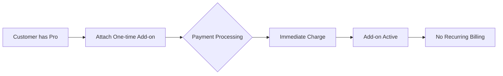

# One-time Add-ons

One-time add-ons are products that charge once without creating recurring subscriptions. Common examples include setup fees, training, consulting, or one-time feature unlocks.



## Identifying One-time Products

```typescript
// server/src/internal/products/productUtils.ts
export const isOneOff = (prices: Price[]) => {
    return prices.every(price =>
        price.config?.interval === BillingInterval.OneOff
    );
};

// Product structure
oneTimeProduct = {
    id: "training",
    name: "Training Session",
    is_add_on: true,
    prices: [{
        config: {
            amount: 50000,  // $500
            interval: BillingInterval.OneOff,
            type: PriceType.Fixed
        }
    }]
}
```

## Branch Determination

One-off products get special treatment:

```typescript
// server/src/internal/customers/attach/attachUtils/getAttachBranch.ts:314-316
if (pricesOnlyOneOff(attachParams.prices)) {
    return AttachBranch.OneOff;
}
```

## The One-off Handler

```typescript
// server/src/internal/customers/attach/attachFunctions/addProductFlow/handleOneOffFunction.ts
export const handleOneOffFunction = async ({ req, res, attachParams, config }) => {
    const { customer, products, stripeCli } = attachParams;

    // 1. Create invoice item (not subscription)
    for (const product of products) {
        for (const price of product.prices) {
            await stripeCli.invoiceItems.create({
                customer: customer.processor.id,
                price: price.processor.id,
                quantity: attachParams.options?.quantity || 1,
                description: product.description,
                metadata: {
                    product_id: product.id,
                    one_time: true
                }
            });
        }
    }

    // 2. Create and finalize invoice immediately
    const invoice = await stripeCli.invoices.create({
        customer: customer.processor.id,
        auto_advance: true,  // Auto-finalize
        collection_method: 'charge_automatically',
        description: `One-time purchase: ${products.map(p => p.name).join(', ')}`
    });

    await stripeCli.invoices.finalizeInvoice(invoice.id);

    // 3. Charge immediately if payment method exists
    if (config.chargeImmediately !== false) {
        await stripeCli.invoices.pay(invoice.id);
    }

    // 4. Record in database
    await createFullCusProduct({
        db: req.db,
        attachParams,
        status: CusProductStatus.Active,
        one_time: true,
        invoice_id: invoice.id
    });
};
```

## Case 1: Pro + One-time Training

Customer adds training to their Pro subscription:

### Request
```typescript
{
    customer_id: "cus_123",
    product_id: "training",  // One-time product
}
```

### Processing
```typescript
// 1. Check existing products
const curMainProduct = findMainProduct(customer);  // Pro subscription

// 2. Verify one-time product
if (isOneOff(trainingProduct.prices)) {
    // Don't modify subscription
    // Create standalone charge
}

// 3. Create invoice item (not subscription item)
await stripeCli.invoiceItems.create({
    customer: "cus_123",
    price: "price_training",
    quantity: 1,
    description: "One-time training session"
});
```

### Result
```typescript
// Customer has both:
cusProducts = [
    {
        product: "pro",
        type: "recurring",
        subscription_ids: ["sub_123"]
    },
    {
        product: "training",
        type: "one_time",
        invoice_ids: ["inv_456"],  // Links to invoice, not subscription
        charged_at: "2024-10-15T10:00:00Z"
    }
]
```

## Case 2: Purchasing Same Add-on Again

Some one-time add-ons can be purchased multiple times:

### First Purchase
```typescript
// October 1: Buy consulting hours
{
    product_id: "consulting_hours",
    options: { quantity: 10 }
}
// Creates: cusProduct_1, invoice_1, charged $1000
```

### Second Purchase
```typescript
// October 15: Buy more consulting hours
{
    product_id: "consulting_hours",
    options: { quantity: 5 }
}

// System checks
const existingPurchases = await getOneTimePurchases(customer, product);

if (product.allow_multiple || product.stackable) {
    // Create new purchase record
    await createNewOneTimePurchase();
} else if (product.quantity_based) {
    // Add to existing quantity
    await updateQuantity(existingPurchases[0], newQuantity);
} else {
    throw new Error("Product already purchased");
}
```

### Result
```typescript
// Multiple purchase records
cusProducts = [
    {
        product: "consulting_hours",
        type: "one_time",
        quantity: 10,
        charged_at: "2024-10-01",
        invoice_id: "inv_1"
    },
    {
        product: "consulting_hours",
        type: "one_time",
        quantity: 5,
        charged_at: "2024-10-15",
        invoice_id: "inv_2"
    }
]

// Or consolidated if quantity-based
cusProducts = [
    {
        product: "consulting_hours",
        type: "one_time",
        quantity: 15,  // Total
        purchase_history: [
            { quantity: 10, date: "2024-10-01", invoice: "inv_1" },
            { quantity: 5, date: "2024-10-15", invoice: "inv_2" }
        ]
    }
]
```

## Special Configurations

### Bundled One-time Charges
```typescript
// Multiple one-time products in single transaction
{
    product_ids: ["setup", "training", "data_migration"]
}

// Create single invoice with multiple lines
const invoice = await stripeCli.invoices.create({
    customer: customerId,
    line_items: [
        { price: "price_setup", quantity: 1 },
        { price: "price_training", quantity: 1 },
        { price: "price_migration", quantity: 1 }
    ]
});
```

### Delayed Charging
```typescript
// One-time product that charges later
if (product.charge_timing === 'end_of_month') {
    await stripeCli.invoiceItems.create({
        customer: customerId,
        price: priceId,
        quantity: 1
    });
    // Don't create invoice immediately
    // Will be included in next regular invoice
}
```

### Credits and Discounts
```typescript
// Apply discount to one-time charge
const invoiceItem = await stripeCli.invoiceItems.create({
    customer: customerId,
    price: priceId,
    quantity: 1,
    discounts: [{
        coupon: "first_training_50off"  // 50% off first training
    }]
});
```

## Validation Rules

### Prevent Duplicates
```typescript
const validateOneTimePurchase = async (customer, product) => {
    if (!product.allow_repurchase) {
        const existing = await findOneTimePurchase(customer, product);
        if (existing) {
            throw new Error(`${product.name} has already been purchased`);
        }
    }
};
```

### Dependency Checks
```typescript
// Some one-time products require active subscription
if (product.requires_active_subscription) {
    const hasActive = customer.cusProducts.some(cp =>
        cp.status === 'active' && !cp.product.is_add_on
    );

    if (!hasActive) {
        throw new Error("Active subscription required for this purchase");
    }
}
```

### Quantity Limits
```typescript
if (product.max_quantity) {
    const totalPurchased = await getTotalQuantityPurchased(customer, product);
    if (totalPurchased + requestedQuantity > product.max_quantity) {
        throw new Error(`Maximum quantity exceeded. Limit: ${product.max_quantity}`);
    }
}
```

## Database Schema

One-time purchases use different fields:

```sql
-- customer_products table for one-time
CREATE TABLE customer_products (
    id UUID PRIMARY KEY,
    customer_id UUID,
    product_id UUID,
    type ENUM('recurring', 'one_time'),

    -- For recurring
    subscription_ids TEXT[],
    status TEXT,

    -- For one-time
    invoice_ids TEXT[],
    charged_at TIMESTAMP,
    quantity INTEGER,

    -- Shared
    created_at TIMESTAMP,
    metadata JSONB
);
```

## Revenue Recognition

One-time products have different accounting:

```typescript
// Immediate revenue recognition
if (product.revenue_recognition === 'immediate') {
    await recordRevenue({
        amount: price,
        date: chargeDate,
        type: 'one_time'
    });
} else if (product.revenue_recognition === 'deferred') {
    // Recognize over service period
    await createDeferredRevenue({
        amount: price,
        start_date: chargeDate,
        end_date: servicePeriodEnd,
        monthly_recognition: price / monthsInPeriod
    });
}
```

## Refund Handling

One-time products may have different refund policies:

```typescript
const processOneTimeRefund = async (cusProduct) => {
    const daysSincePurchase = getDaysSince(cusProduct.charged_at);

    if (daysSincePurchase > product.refund_window_days) {
        throw new Error("Refund window has passed");
    }

    // Process refund
    await stripeCli.refunds.create({
        invoice: cusProduct.invoice_ids[0],
        amount: cusProduct.amount,  // Full or partial
        reason: 'requested_by_customer'
    });

    // Update database
    await CusProductService.update({
        cusProductId: cusProduct.id,
        updates: {
            refunded: true,
            refunded_at: Date.now(),
            status: CusProductStatus.Refunded
        }
    });
};
```

## Best Practices

1. **Clear Pricing**: Show one-time vs recurring clearly
2. **Purchase History**: Maintain detailed records
3. **Prevent Accidents**: Confirm before charging large amounts
4. **Flexible Policies**: Allow repurchase where sensible
5. **Revenue Tracking**: Separate one-time from recurring revenue