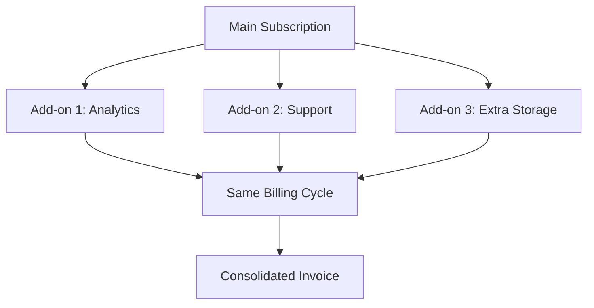

# Recurring Add-ons

Recurring add-ons are supplementary products that bill alongside the main subscription. They share the same billing cycle and are managed as part of the primary subscription.



## Add-on Product Structure

```typescript
// Recurring add-on definition
const analyticsAddon = {
    id: "analytics_addon",
    name: "Advanced Analytics",
    is_add_on: true,  // ← Key flag
    prices: [{
        config: {
            amount: 2000,  // $20/month
            interval: BillingInterval.Month,
            type: PriceType.Fixed
        }
    }],
    requires_main_product: true,
    compatible_with: ["pro", "premium"]  // Which main products it works with
};
```

## Adding Recurring Add-ons

### Branch Determination

```typescript
// server/src/internal/customers/attach/attachUtils/getAttachBranch.ts
const getSameProductBranch = async ({ attachParams }) => {
    const product = attachParams.products[0];

    // Add-ons get special treatment
    if (product.is_add_on) {
        return AttachBranch.AddOn;
    }
    // ... other logic
};
```

### Validation

```typescript
// Ensure customer has compatible main product
const validateAddon = async (addon, customer) => {
    const mainProduct = customer.cusProducts.find(cp =>
        !cp.product.is_add_on &&
        cp.status === 'active'
    );

    if (!mainProduct) {
        throw new Error("Add-on requires an active main subscription");
    }

    if (addon.compatible_with &&
        !addon.compatible_with.includes(mainProduct.product.id)) {
        throw new Error(
            `${addon.name} is not compatible with ${mainProduct.product.name}`
        );
    }
};
```

## Case 1: Pro + Analytics Add-on

Customer adds analytics to their Pro plan:

### Initial State
```typescript
// Customer has Pro
subscription = {
    id: "sub_123",
    items: [
        { id: "si_pro", price: "price_pro", quantity: 1 }
    ],
    current_period_end: 1701388800  // Dec 1, 2024
}
```

### Add Analytics
```typescript
// Request
{
    customer_id: "cus_123",
    product_id: "analytics_addon"
}

// Processing
const updatedSub = await stripeCli.subscriptions.update("sub_123", {
    items: [
        { id: "si_pro" },  // Keep existing
        { price: "price_analytics" }  // Add new
    ],
    proration_behavior: 'create_prorations'
});
```

### Result
```typescript
// Updated subscription
subscription = {
    id: "sub_123",
    items: [
        { id: "si_pro", price: "price_pro", quantity: 1 },
        { id: "si_analytics", price: "price_analytics", quantity: 1 }
    ]
}

// Next invoice will include both
invoice = {
    lines: [
        { description: "Pro Plan", amount: 50 },
        { description: "Analytics Add-on", amount: 20 }
    ],
    total: 70
}
```

## Case 2: Multiple Add-ons

Customer has Pro with multiple add-ons:

### Adding Second Add-on
```typescript
// Customer already has: Pro + Analytics
// Adding: Support add-on

// Current state
subscription.items = [
    { price: "price_pro" },
    { price: "price_analytics" }
]

// Add support
const updatedSub = await stripeCli.subscriptions.update("sub_123", {
    items: [
        { id: "si_pro" },
        { id: "si_analytics" },
        { price: "price_support" }  // Add third item
    ]
});

// Result: 3 subscription items
```

### Database State
```typescript
cusProducts = [
    {
        product: "pro",
        is_add_on: false,
        subscription_ids: ["sub_123"],
        status: "active"
    },
    {
        product: "analytics",
        is_add_on: true,
        subscription_ids: ["sub_123"],  // Same subscription
        status: "active"
    },
    {
        product: "support",
        is_add_on: true,
        subscription_ids: ["sub_123"],  // Same subscription
        status: "active"
    }
]
```

## Usage-Based Add-ons

Some add-ons charge based on usage:

```typescript
// Usage-based add-on
const apiAddon = {
    id: "api_calls",
    is_add_on: true,
    prices: [{
        config: {
            interval: BillingInterval.Month,
            type: PriceType.Usage,
            billing_type: BillingType.UsageInArrear,
            usage_tiers: [
                { up_to: 1000, amount: 0 },      // First 1000 free
                { up_to: 10000, amount: 1 },     // $0.01 per call
                { up_to: null, amount: 0.5 }     // $0.005 per call after 10k
            ]
        }
    }]
};

// Add to subscription
await stripeCli.subscriptions.update("sub_123", {
    items: [
        { id: "si_pro" },
        {
            price: "price_api_calls",
            // No quantity for usage-based
        }
    ]
});

// Report usage throughout the month
await stripeCli.subscriptionItems.createUsageRecord("si_api", {
    quantity: 500,
    timestamp: Math.floor(Date.now() / 1000)
});
```

## Removing Add-ons

### Immediate Removal
```typescript
const removeAddon = async (customer, addonId) => {
    const addon = customer.cusProducts.find(cp =>
        cp.product.id === addonId && cp.product.is_add_on
    );

    const subItem = await findSubscriptionItem(addon);

    // Remove from subscription
    await stripeCli.subscriptionItems.del(subItem.id, {
        proration_behavior: 'create_prorations'
    });

    // Update database
    await CusProductService.update({
        cusProductId: addon.id,
        updates: {
            status: CusProductStatus.Expired,
            ended_at: Date.now()
        }
    });
};
```

### Scheduled Removal
```typescript
// Remove at period end (like downgrades)
await stripeCli.subscriptionItems.update(subItem.id, {
    metadata: {
        cancel_at_period_end: 'true'
    }
});

// Or use subscription schedules
await createSchedule({
    phases: [
        {
            items: currentItems,
            end_date: periodEnd
        },
        {
            items: currentItems.filter(i => i.id !== addonItem.id),
            start_date: periodEnd
        }
    ]
});
```

## Add-on Dependencies

Some add-ons require others:

```typescript
// Advanced analytics requires basic analytics
const addonDependencies = {
    'analytics_advanced': ['analytics_basic'],
    'support_phone': ['support_email'],
    'storage_1tb': ['storage_100gb']
};

const validateAddonDependencies = (requestedAddon, existingAddons) => {
    const requires = addonDependencies[requestedAddon.id];

    if (requires) {
        const hasAll = requires.every(dep =>
            existingAddons.some(a => a.id === dep)
        );

        if (!hasAll) {
            throw new Error(
                `${requestedAddon.name} requires ${requires.join(', ')}`
            );
        }
    }
};
```

## Billing Alignment

Add-ons align with main subscription:

```typescript
// When adding mid-cycle
const alignAddonBilling = async (mainSub, addonPrice) => {
    const remainingDays = getDaysUntil(mainSub.current_period_end);
    const proratedAmount = (addonPrice / 30) * remainingDays;

    // Charge prorated amount immediately
    await stripeCli.invoiceItems.create({
        customer: mainSub.customer,
        amount: Math.round(proratedAmount),
        description: `Prorated charge for add-on (${remainingDays} days)`
    });

    // Add to subscription for future billing
    await stripeCli.subscriptions.update(mainSub.id, {
        items: [
            ...mainSub.items.data,
            { price: addonPriceId }
        ]
    });
};
```

## Bundle Detection

System can offer bundles:

```typescript
// Detect if add-ons form a bundle
const checkForBundle = (addons) => {
    const bundles = {
        'productivity_pack': ['analytics', 'automation', 'integrations'],
        'support_bundle': ['support_email', 'support_phone', 'support_priority']
    };

    for (const [bundle, required] of Object.entries(bundles)) {
        if (required.every(r => addons.some(a => a.id === r))) {
            return {
                bundle,
                discount: 0.2,  // 20% off
                message: "Eligible for productivity pack bundle!"
            };
        }
    }
};
```

## Edge Cases

### Main Product Cancellation
```typescript
// When main product is cancelled, handle add-ons
const handleMainCancellation = async (mainProduct) => {
    const addons = await getProductAddons(mainProduct);

    for (const addon of addons) {
        if (addon.requires_main_product) {
            // Cancel add-ons too
            await cancelAddon(addon);
        } else if (addon.can_be_standalone) {
            // Convert to standalone subscription
            await convertToStandalone(addon);
        }
    }
};
```

### Add-on Upgrades
```typescript
// Upgrade from basic to advanced add-on
const upgradeAddon = async (customer, fromAddon, toAddon) => {
    // Find current subscription item
    const currentItem = await findSubItem(fromAddon);

    // Replace with new add-on
    await stripeCli.subscriptions.update(sub.id, {
        items: [
            { id: currentItem.id, deleted: true },
            { price: toAddon.price_id }
        ],
        proration_behavior: 'create_prorations'
    });
};
```

### Quantity-Based Add-ons
```typescript
// Add-ons with variable quantity (e.g., extra seats)
const extraSeats = {
    id: "extra_seats",
    is_add_on: true,
    prices: [{
        amount: 1000,  // $10 per seat
        interval: BillingInterval.Month,
        per_unit: true
    }]
};

// Add 5 extra seats
await stripeCli.subscriptions.update(sub.id, {
    items: [
        ...existingItems,
        {
            price: "price_extra_seats",
            quantity: 5  // 5 seats × $10 = $50/month
        }
    ]
});
```

## Best Practices

1. **Clear Relationships**: Show which add-ons work with which plans
2. **Bundle Suggestions**: Recommend bundles when cost-effective
3. **Dependency Validation**: Check requirements before adding
4. **Proration Transparency**: Show prorated charges clearly
5. **Cancellation Clarity**: Explain what happens to add-ons when main cancels

## Summary

Recurring add-ons provide flexible product composition:
- Supplement main subscriptions
- Share billing cycles
- Support complex pricing models
- Enable upselling opportunities
- Maintain clean subscription structure

The attach router handles all these scenarios seamlessly, ensuring proper billing, database consistency, and excellent customer experience.