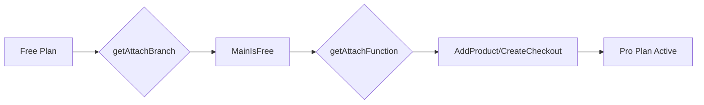

# Free → Pro Upgrade

This is one of the simplest upgrade scenarios in the attach router system. When a customer moves from a free plan to a paid plan, the system treats it almost like a new subscription.

## Flow Overview



## Step 1: Checking for Existing Products

When the attach request comes in, the system calls `getExistingCusProducts` to understand the customer's current state:

```typescript
// server/src/internal/customers/cusProducts/cusProductUtils/getExistingCusProducts.ts:27-41
const curMainProduct = cusProducts.find((cp: any) => {
    const sameGroup = cp.product.group === product.group;  // Same product family
    const isMain = !cp.product.is_add_on;                   // Not an add-on
    const isActive = cp.status === Active || PastDue;       // Currently active
    const oneOff = isOneOff(cp.customer_prices...);        // Not a one-time charge
    const sameEntity = ...;                                 // Same entity if multi-entity

    return sameGroup && isMain && isActive && !oneOff && sameEntity;
});
```

For a free → pro upgrade:
- **curMainProduct**: Found (the free plan with price = $0)
- **curSameProduct**: Not found (customer doesn't have Pro yet)
- **curScheduledProduct**: Usually not found

## Step 2: Branch Determination

The system determines this is a `MainIsFree` branch:

```typescript
// server/src/internal/customers/attach/attachUtils/getAttachBranch.ts:264-268
const getChangeProductBranch = async ({ attachParams }) => {
    const mainProduct = cusProductToProduct({ cusProduct: curMainProduct! });
    if (isFreeProduct(mainProduct.prices)) {
        return AttachBranch.MainIsFree;
    }
    // ... other logic
}
```

The `isFreeProduct` function checks if total price equals $0:

```typescript
// server/src/internal/products/productUtils.ts:171-188
export const isFreeProduct = (prices: Price[]) => {
    if (prices.length === 0) return true;

    let totalPrice = 0;
    for (const price of prices) {
        if ("usage_tiers" in price.config!) {
            totalPrice += price.config!.usage_tiers.reduce(
                (acc, tier) => acc + tier.amount, 0
            );
        } else {
            totalPrice += price.config!.amount;
        }
    }
    return totalPrice === 0;
};
```

## Step 3: Function Selection

For `MainIsFree` branch, the system selects either:
- **CreateCheckout**: If payment method setup is required
- **AddProduct**: If payment method exists or not required

```typescript
// server/src/internal/customers/attach/attachUtils/getAttachFunction.ts:46-70
const newScenario = [
    AttachBranch.MultiAttach,
    AttachBranch.MultiProduct,
    AttachBranch.OneOff,
    AttachBranch.New,
    AttachBranch.AddOn,
    AttachBranch.MainIsFree,  // ← Our case
    AttachBranch.MainIsTrial,
].includes(branch);

if (newScenario && onlyCheckout) {
    return AttachFunction.CreateCheckout;
} else if (newScenario) {
    return AttachFunction.AddProduct;
}
```

## Step 4: Execution

### No Cancellation Needed!

Unlike trial upgrades, **free plans don't need cancellation**:
- Free product has $0 value
- No refunds or proration needed
- No active Stripe subscription to cancel
- Free product can coexist or naturally expire

The system simply adds the new Pro subscription:

```typescript
// server/src/internal/customers/attach/attachFunctions/addProductFlow/handleAddProduct.ts:40-47
if (prices.length > 0) {  // Pro has prices
    await handlePaidProduct({
        req,
        res,
        attachParams,
        config: config || defaultConfig,
    });
    return;
}
```

### Contrast with Trial Cancellation

When upgrading from a trial, the system MUST cancel:

```typescript
// server/src/internal/customers/attach/attachUtils/getAttachFunction.ts:189-209
if (branch === AttachBranch.MainIsTrial) {
    // Cancel the trial subscription
    await CusProductService.update({
        cusProductId: curMainProduct!.id,
        updates: {
            ended_at: attachParams.now,
            canceled: true,
            status: CusProductStatus.Expired,
        },
    });

    // Cancel in Stripe too
    const subId = curMainProduct?.subscription_ids?.[0];
    if (subId) {
        await stripeCli.subscriptions.cancel(subId, {
            cancellation_details: {
                comment: "autumn_downgrade,trial_canceled",
            },
        });
    }
}
```

## Why the Difference?

### Free Plans
- No active payment obligations
- No automatic conversion risk
- Can safely coexist with paid plans
- Natural expiration is sufficient

### Trial Plans
- Have active Stripe subscriptions
- May auto-convert to paid if not cancelled
- Need explicit termination to prevent charges
- Require proper cleanup in Stripe

## Customer Experience

From the customer's perspective:
1. Clicks upgrade from free plan
2. Either:
   - Redirected to Stripe checkout (if payment needed)
   - Immediately upgraded (if payment on file)
3. Instantly has access to Pro features
4. Starts being billed for Pro plan

## Edge Cases

### Multiple Free Products
If a customer has multiple free products in different groups, each can be upgraded independently without affecting others.

### Free Plan with Usage Components
Some "free" plans might have $0 base price but usage-based components. These are still treated as free for upgrade purposes if the base price is $0.

### Entity-Specific Free Plans
In multi-entity setups, each entity can have its own free plan and upgrade independently.