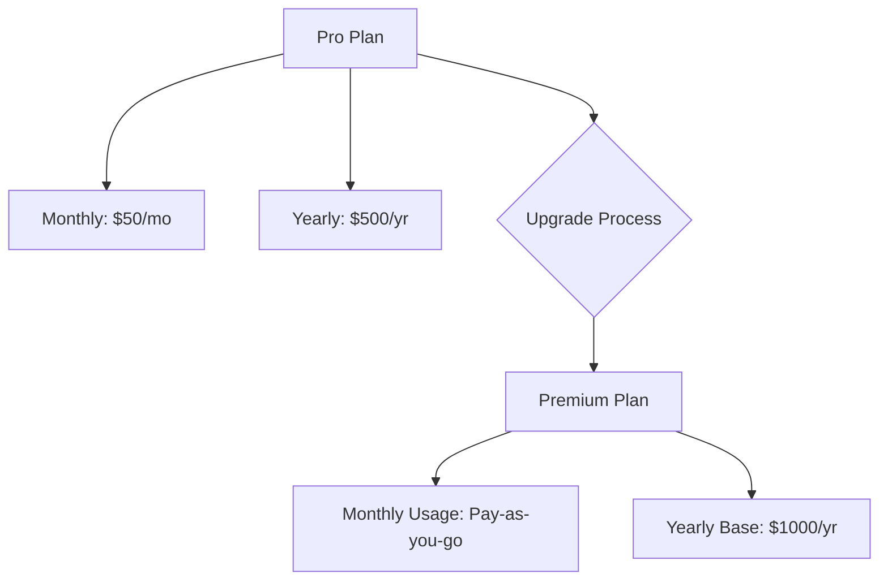

# Multi-interval Upgrades

The most complex upgrade scenario: Pro (Monthly + Yearly) → Premium (Monthly Usage + Yearly Base). This involves products with multiple price components billing at different intervals.

## Scenario Overview



## Product Structure

### Pro Product Components
```typescript
// Pro has multiple fixed prices
proProduct = {
    prices: [
        {
            id: "price_pro_monthly",
            config: {
                amount: 5000,  // $50
                interval: BillingInterval.Month,
                type: PriceType.Fixed
            }
        },
        {
            id: "price_pro_yearly",
            config: {
                amount: 50000,  // $500
                interval: BillingInterval.Year,
                type: PriceType.Fixed
            }
        }
    ]
}
```

### Premium Product Components
```typescript
// Premium has usage + base pricing
premiumProduct = {
    prices: [
        {
            id: "price_premium_usage",
            config: {
                interval: BillingInterval.Month,
                type: PriceType.Usage,
                billing_type: BillingType.UsageInArrear,
                usage_tiers: [{ amount: 10, up_to: null }]  // $0.10 per unit
            }
        },
        {
            id: "price_premium_base",
            config: {
                amount: 100000,  // $1000
                interval: BillingInterval.Year,
                type: PriceType.Fixed
            }
        }
    ]
}
```

## Step 1: Branch Determination

The system aggregates all components to determine if it's an upgrade:

```typescript
// server/src/internal/products/productUtils.ts:140-150
const getTotalPrice = (prices: Price[]) => {
    let totalPrice = new Decimal(0);
    for (const price of prices) {
        if ("usage_tiers" in price.config!) {
            // For usage prices, use first tier as estimate
            totalPrice = totalPrice.plus(price.config!.usage_tiers[0].amount);
        } else {
            totalPrice = totalPrice.plus(price.config!.amount);
        }
    }
    return totalPrice.toNumber();
};
```

## Step 2: Subscription Items Orchestration

Each price component becomes a separate subscription item in Stripe:

### Current State (Pro)
```typescript
subscription.items = [
    {
        id: "si_123",
        price: "price_pro_monthly",
        quantity: 1,
        // Bills on the 15th of each month
    },
    {
        id: "si_456",
        price: "price_pro_yearly",
        quantity: 1,
        // Bills on January 1st each year
    }
]
```

### Target State (Premium)
```typescript
subscription.items = [
    {
        price: "price_premium_usage",
        quantity: null,  // Usage-based, no fixed quantity
        // Bills monthly based on usage
    },
    {
        price: "price_premium_base",
        quantity: 1,
        // Bills yearly
    }
]
```

## Step 3: The Complex Upgrade Process

The `paramsToSubItems` function handles the transformation:

```typescript
// server/src/internal/customers/attach/mergeUtils/paramsToSubItems.ts:100-240
export const paramsToSubItems = async ({ req, sub, attachParams, config }) => {
    let curSubItems = sub?.items.data || [];

    // Get new items to add
    const itemSet = await getStripeSubItems2({ attachParams, config });

    // Get products to remove (Pro components)
    const cusProductsToRemove = getCusProductsToRemove({ attachParams });

    // For each product being removed
    for (const cusProduct of cusProductsToRemove) {
        const prices = cusProductToPrices({ cusProduct });

        for (const price of prices) {
            const existingSubItem = findStripeItemForPrice({
                price,
                stripeItems: curSubItems,
            });

            if (existingSubItem) {
                // Handle based on price type
                if (isArrearPrice({ price })) {
                    // Usage prices need special handling
                    // Check if shared with other products
                    if (!sharedWithOtherProducts) {
                        newSubItems.push({
                            id: existingSubItem.id,
                            deleted: true
                        });
                    }
                } else {
                    // Fixed prices - mark for deletion
                    newSubItems.push({
                        id: existingSubItem.id,
                        deleted: true
                    });
                }
            }
        }
    }

    // Add new Premium items
    newSubItems = mergeNewSubItems({
        itemSet,  // Premium items
        curSubItems  // Existing items
    });

    return { subItems: newSubItems };
};
```

## Step 4: Billing Cycle Alignment

The critical challenge: Different components have different renewal dates!

### Scenario Example
- **Date**: October 20th
- **Pro Monthly**: Renews on 15th of each month
- **Pro Yearly**: Renews on January 1st
- **Upgrade Date**: October 20th

### Proration Calculations

```typescript
// Monthly component proration
const monthlyProration = {
    // Pro Monthly (Oct 20-31)
    daysRemaining: 11,
    dailyRate: 50 / 30,  // $1.67 per day
    credit: 11 * 1.67,    // $18.37 credit

    // Premium Usage starts immediately
    // No upfront charge for usage (billed in arrears)
};

// Yearly component proration
const yearlyProration = {
    // Pro Yearly (Oct 20 - Dec 31)
    daysRemaining: 72,
    dailyRate: 500 / 365,  // $1.37 per day
    credit: 72 * 1.37,      // $98.64 credit

    // Premium Base (Oct 20 - Dec 31)
    daysInPeriod: 72,
    dailyRate: 1000 / 365,  // $2.74 per day
    charge: 72 * 2.74,      // $197.28 charge
};

// Net adjustment
const totalCredit = 18.37 + 98.64;  // $117.01
const totalCharge = 197.28;         // $197.28
const netCharge = 80.27;            // Customer pays $80.27
```

## Step 5: Usage Billing Configuration

For the usage-based component:

```typescript
// server/src/internal/customers/attach/attachFunctions/upgradeFlow/updateStripeSub2.ts
if (isArrearPrice({ price })) {
    // Usage billed in arrears
    subItemUpdate = {
        price: price.processor.id,
        // No quantity specified for usage-based
        billing_thresholds: config.billingThresholds,
        metadata: {
            feature_id: price.feature_id,
            billing_type: 'usage_in_arrear'
        }
    };
} else {
    // Fixed price
    subItemUpdate = {
        price: price.processor.id,
        quantity: options?.quantity || 1
    };
}
```

## Step 6: The Final Stripe API Call

```typescript
// Combined update call to Stripe
const updatedSubscription = await stripeCli.subscriptions.update(subscriptionId, {
    items: [
        // Remove Pro components
        { id: "si_123", deleted: true },           // Pro monthly
        { id: "si_456", deleted: true },           // Pro yearly

        // Add Premium components
        { price: "price_premium_usage" },          // Premium usage (no quantity)
        { price: "price_premium_base", quantity: 1 }  // Premium base
    ],
    proration_behavior: "create_prorations",
    billing_cycle_anchor: "unchanged",  // Maintain existing anchors
    collection_method: "charge_automatically"
});
```

## Customer Experience Timeline

### Day of Upgrade (Oct 20)
1. **Immediate Changes**:
   - Premium features activate
   - Usage tracking begins
   - One adjustment invoice generated

2. **Adjustment Invoice Contains**:
   - Credit: $18.37 (unused Pro monthly)
   - Credit: $98.64 (unused Pro yearly)
   - Charge: $197.28 (Premium base prorated)
   - **Net charge: $80.27**

### First Month (Nov 15)
- Premium usage bill for October usage
- No fixed monthly charge (usage only)

### Year End (Jan 1)
- Full $1000 yearly base charge
- Billing cycles now aligned

## Edge Cases

### Different Billing Anchors
When monthly and yearly components have different billing anchors:
```typescript
// System maintains separate anchors
subscription.items = [
    {
        price: "premium_usage",
        billing_cycle_anchor: 15,  // Monthly on 15th
    },
    {
        price: "premium_base",
        billing_cycle_anchor: "2024-01-01",  // Yearly on Jan 1
    }
]
```

### Partial Usage Period
First usage billing period is prorated:
- Usage from Oct 20-31 only
- Billed on Nov 15
- Full month usage thereafter

### Multiple Entities
Each entity can have different component combinations:
```typescript
// Entity A: Monthly + Yearly
// Entity B: Monthly only
// Entity C: Yearly only
// All managed within same subscription
```

## Technical Considerations

### Database Complexity
Multiple tables track the components:
```sql
-- customer_products: One record per product
-- customer_prices: Multiple records per product (one per price)
-- subscription_items: Mirrors Stripe's subscription items
-- usage_records: Tracks usage for billing
```

### Webhook Handling
System must handle multiple webhook events:
- `invoice.created` - For each billing event
- `invoice.payment_succeeded` - Payment confirmation
- `subscription_schedule.updated` - If using schedules
- `usage_record.created` - Usage tracking

### Rollback Complexity
Reverting multi-component upgrades requires:
1. Calculating reverse proration
2. Restoring all original items
3. Adjusting usage tracking
4. Handling partial period complications

## Why This Matters

Multi-interval upgrades represent the most complex billing scenarios:
- Tests system's ability to handle component orchestration
- Requires precise proration logic
- Must maintain billing cycle integrity
- Ensures accurate revenue recognition

This complexity is what makes the Autumn attach router system sophisticated enough to handle enterprise billing requirements.