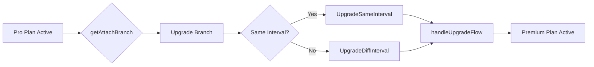

# Pro → Premium Upgrade

This is a classic paid-to-paid upgrade scenario where the system needs to handle proration, immediate billing changes, and proper subscription management.

## Flow Overview



## Step 1: Branch Determination

When the system detects both plans are paid, it checks if it's an upgrade:

```typescript
// server/src/internal/customers/attach/attachUtils/getAttachBranch.ts:254-291
const getChangeProductBranch = async ({ attachParams }) => {
    const curMainProduct = // finds Pro subscription (active, paid)
    const curPrices = cusProductToPrices({ cusProduct: curMainProduct }); // Pro prices
    const newPrices = attachParams.prices; // Premium prices

    const isUpgrade = isProductUpgrade({
        prices1: curPrices,  // Pro
        prices2: newPrices,  // Premium
    });

    if (isUpgrade) {
        const isTrial = isMainTrialBranch({ attachParams });
        if (isTrial) {
            return AttachBranch.MainIsTrial;
        }
        return AttachBranch.Upgrade;  // ← Our case
    }

    return AttachBranch.Downgrade;
};
```

## Step 2: Determining if it's an Upgrade

The `isProductUpgrade` function uses sophisticated logic:

```typescript
// server/src/internal/products/productUtils.ts:107-169
export const isProductUpgrade = ({ prices1, prices2 }) => {
    // Free to paid is always an upgrade
    if (isFreeProduct(prices1) && !isFreeProduct(prices2)) {
        return true;
    }

    // Paid to free is always a downgrade
    if (!isFreeProduct(prices1) && isFreeProduct(prices2)) {
        return false;
    }

    // For two paid products, compare prices
    if (intervalsSame({ intervalA: billingInterval1, intervalB: billingInterval2 })) {
        // Same interval: direct price comparison
        return getTotalPrice(prices1) < getTotalPrice(prices2);
    } else {
        // Different intervals: compare interval values
        // Monthly < Quarterly < Yearly
        return compareBillingIntervals({ configA: billingInterval1, configB: billingInterval2 }) > 0;
    }
};
```

## Step 3: Function Selection

Based on whether billing intervals match:

```typescript
// server/src/internal/customers/attach/attachUtils/getAttachFunction.ts:73-86
const updateScenarios = [
    AttachBranch.NewVersion,
    AttachBranch.SameCustom,
    AttachBranch.SameCustomEnts,
    AttachBranch.Upgrade,  // ← Our case
];

if (updateScenarios.includes(branch)) {
    if (config.sameIntervals) {
        return AttachFunction.UpgradeSameInterval;  // Pro monthly → Premium monthly
    } else {
        return AttachFunction.UpgradeDiffInterval;  // Pro monthly → Premium yearly
    }
}
```

## Step 4: Execution - The Upgrade Flow

The `handleUpgradeFlow` manages the complex upgrade process:

### A. Same Interval Upgrade (e.g., Monthly → Monthly)

```typescript
// server/src/internal/customers/attach/attachFunctions/upgradeFlow/handleUpgradeFlow.ts
export const handleUpgradeFlow = async ({ req, res, attachParams, config, branch }) => {
    const curCusProduct = attachParamsToCurCusProduct({ attachParams });
    const curSub = await paramsToCurSub({ attachParams });

    // Get current subscription items
    const itemSet = await getStripeSubItems2({ attachParams, config });

    // Calculate new subscription items
    const newItemSet = await paramsToSubItems({
        req,
        sub: curSub,
        attachParams,
        config,
    });

    // Update the Stripe subscription
    const updatedSub = await stripeCli.subscriptions.update(curSub.id, {
        items: newItemSet.subItems,
        proration_behavior: config.prorationBehavior || 'create_prorations',
    });
};
```

### B. Different Interval Upgrade (e.g., Monthly → Yearly)

This is more complex as it may require:
- Billing cycle alignment
- Schedule for next period
- Complex proration calculations

## Step 5: Proration Magic

Stripe automatically handles proration when updating subscriptions:

```typescript
// Example proration calculation (handled by Stripe)
const unusedProDays = 20;  // Days left in current month
const monthlyRate = 50;     // Pro monthly cost
const dailyRate = monthlyRate / 30;
const credit = unusedProDays * dailyRate;  // Credit for unused Pro time

const premiumMonthlyRate = 100;
const premiumDailyRate = premiumMonthlyRate / 30;
const charge = unusedProDays * premiumDailyRate;  // Charge for Premium time

const netCharge = charge - credit;  // Customer pays the difference
```

## Step 6: Cancelling the Old Subscription

Unlike free plans, Pro subscription IS cancelled because:

```typescript
// The Pro subscription needs proper handling:
// 1. Has monetary value requiring proration
// 2. Can't have two paid main products simultaneously
// 3. Stripe needs to stop future Pro charges

// In handleUpgradeFlow, old items are marked for deletion:
for (const cusProduct of cusProductsToRemove) {
    for (const price of prices) {
        const existingSubItem = findStripeItemForPrice({ price, stripeItems: curSubItems });

        if (existingSubItem) {
            newSubItems.push({
                id: existingSubItem.id,
                deleted: true,  // ← Mark for deletion
            });
        }
    }
}
```

## Customer Experience

### Immediate Upgrade
1. Customer initiates upgrade
2. System calculates proration instantly
3. Customer is charged the prorated difference
4. Premium features activate immediately
5. Future bills reflect new Premium pricing

### Billing Timeline Example
- Day 1 of month: Customer on Pro ($50/month)
- Day 10: Upgrades to Premium ($100/month)
- Immediate charge: ~$33 (prorated difference for remaining 20 days)
- Next month: Full $100 Premium charge

## Edge Cases

### Mid-Cycle Upgrades
When upgrading mid-billing cycle:
- Credits are calculated to the hour
- Charges are prorated precisely
- Customer only pays the exact difference

### Multiple Price Components
If Pro has multiple prices (base + add-ons):
- Each component is prorated separately
- All credits and charges are aggregated
- Single invoice shows all adjustments

### Failed Payment Handling
If the upgrade charge fails:
- Subscription remains on Pro
- Customer retains Pro access
- Retry logic attempts payment again

## Comparison with Free → Pro

| Aspect | Free → Pro | Pro → Premium |
|--------|-----------|---------------|
| Cancellation needed | No | Yes |
| Proration | None | Required |
| Stripe subscription | Create new | Update existing |
| Billing impact | Start charging | Adjust charges |
| Rollback complexity | Simple | Complex |

## Technical Details

### Subscription Items Management
```typescript
// Current Pro subscription structure
subscription.items = [
    { id: "si_pro_123", price: "price_pro", quantity: 1 }
]

// After upgrade to Premium
subscription.items = [
    { id: "si_pro_123", deleted: true },  // Remove Pro
    { price: "price_premium", quantity: 1 }  // Add Premium
]
```

### Database Updates
The system updates multiple tables:
1. `customer_products` - Mark Pro as ended, create Premium entry
2. `customer_prices` - Update price associations
3. `subscription_items` - Sync with Stripe changes
4. `invoices` - Record proration invoice