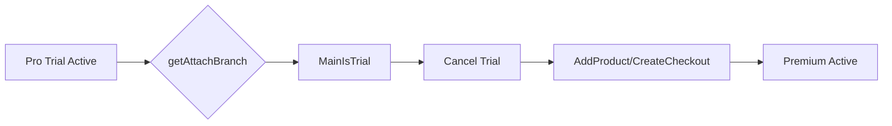
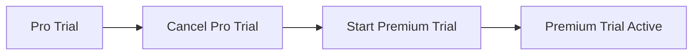

# Trial Upgrades

Trial upgrades involve special handling because trials have active Stripe subscriptions that must be properly cancelled to prevent automatic conversion.

## Case 1: Pro Trial → Premium (Paid)

Converting from a trial to a paid plan requires immediate cancellation of the trial.



### Branch Determination

```typescript
// server/src/internal/customers/attach/attachUtils/getAttachBranch.ts:281-286
if (isUpgrade) {
    const isTrial = isMainTrialBranch({ attachParams });
    if (isTrial) {
        return AttachBranch.MainIsTrial;  // ← Trial upgrade path
    }
    return AttachBranch.Upgrade;
}
```

### The Trial Check

```typescript
// server/src/internal/customers/attach/attachUtils/attachUtils.ts
export const isMainTrialBranch = ({ attachParams }) => {
    const curMainProduct = attachParams.curMainProduct;

    // Check if current product is in trial
    if (curMainProduct?.free_trial) {
        const trialEnd = curMainProduct.free_trial.ended_at;
        const now = Date.now();

        // Still in trial period?
        return !trialEnd || trialEnd > now;
    }

    return false;
};
```

### Trial Cancellation Process

The system MUST cancel the trial subscription:

```typescript
// server/src/internal/customers/attach/attachUtils/getAttachFunction.ts:189-209
if (branch === AttachBranch.MainIsTrial) {
    // 1. Update database - mark trial as expired
    await CusProductService.update({
        db,
        cusProductId: curMainProduct!.id,
        updates: {
            ended_at: attachParams.now,
            canceled: true,
            status: CusProductStatus.Expired,
        },
    });

    // 2. Cancel in Stripe - prevent auto-conversion
    const subId = curMainProduct?.subscription_ids?.[0];
    if (subId) {
        await stripeCli.subscriptions.cancel(subId, {
            cancellation_details: {
                comment: "autumn_downgrade,trial_canceled",
            },
        });
    }
}

// Then continue with adding Premium...
```

### Why Cancel the Trial?

Trials are dangerous if not cancelled:
1. **Auto-conversion Risk**: Trial might convert to paid Pro automatically
2. **Double Billing**: Customer could end up with both Pro and Premium
3. **Stripe State**: Active trial subscription conflicts with new subscription
4. **Clear Intent**: Customer explicitly chose Premium over Pro

## Case 2: Pro Trial → Premium Trial

Upgrading from one trial to another trial - maintaining trial status while changing tiers.



### Special Handling for Trial-to-Trial

```typescript
// When both products have trials
if (curMainProduct?.free_trial && newProduct.free_trial) {
    // Determine remaining trial time
    const originalTrialEnd = curMainProduct.free_trial.ended_at;
    const now = Date.now();
    const remainingTrialDays = Math.ceil((originalTrialEnd - now) / (1000 * 60 * 60 * 24));

    // Apply to new trial
    if (config.carryOverTrialTime) {
        attachParams.freeTrial = {
            ...newProduct.free_trial,
            duration_days: remainingTrialDays  // Preserve remaining trial time
        };
    }
}
```

### Trial Time Carryover

Two approaches for trial duration:

#### Option 1: Preserve Remaining Time
```typescript
// Customer had 14-day Pro trial, used 5 days
// Upgrades to Premium trial
// Premium trial = 9 days remaining

newTrial = {
    started_at: now,
    duration_days: remainingTrialDays,  // 9 days
    ended_at: originalTrialEnd  // Same end date as Pro trial
}
```

#### Option 2: Reset Trial Period
```typescript
// Customer gets full new trial period
newTrial = {
    started_at: now,
    duration_days: premiumProduct.free_trial.duration_days,  // Full 30 days
    ended_at: now + (30 * 24 * 60 * 60 * 1000)
}
```

### Database Updates

```typescript
// Mark old trial as ended
await CusProductService.update({
    cusProductId: proTrialId,
    updates: {
        status: CusProductStatus.Expired,
        ended_at: now,
        ended_reason: 'upgraded_to_premium_trial'
    }
});

// Create new trial
await CusProductService.create({
    product_id: premiumProduct.id,
    customer_id: customer.id,
    status: CusProductStatus.Active,
    free_trial: {
        duration_days: calculatedDays,
        started_at: now,
        ended_at: calculatedEndDate
    }
});
```

## Case 3: Trial with Payment Method vs Without

### With Payment Method
```typescript
if (await customerHasPm({ attachParams })) {
    // Direct upgrade, no checkout needed
    return AttachFunction.AddProduct;
}
```

Customer experience:
1. Clicks upgrade
2. Immediately on Premium
3. Card will be charged after trial

### Without Payment Method
```typescript
if (!paymentMethod && !config.allowNoPayment) {
    // Requires checkout for payment setup
    return AttachFunction.CreateCheckout;
}
```

Customer experience:
1. Clicks upgrade
2. Redirected to Stripe checkout
3. Enters payment details
4. Premium trial begins

## Edge Cases

### Expired Trial Upgrades
```typescript
if (curMainProduct?.free_trial && trialExpired) {
    // Treat as regular paid upgrade
    return AttachBranch.Upgrade;  // Not MainIsTrial
}
```

### Multiple Trial Eligibility
Some products might offer multiple trial periods:
```typescript
// Customer had Pro trial (used)
// Premium offers new trial even for existing customers
if (product.allow_multiple_trials || !customerHadTrial(product)) {
    attachParams.freeTrial = product.free_trial;
}
```

### Trial Abuse Prevention
```typescript
// Check trial history
const trialHistory = await getCustomerTrialHistory(customer.id);

if (trialHistory.length >= config.maxTrialsPerCustomer) {
    // No trial, direct to paid
    attachParams.freeTrial = null;
}
```

## Stripe Subscription States

### During Pro Trial
```json
{
    "id": "sub_trial_pro",
    "status": "trialing",
    "trial_end": 1699920000,
    "items": [{
        "price": "price_pro",
        "quantity": 1
    }],
    "cancel_at_period_end": false
}
```

### After Upgrade to Premium
```json
{
    "id": "sub_trial_pro",
    "status": "canceled",
    "canceled_at": 1699833600,
    "cancellation_details": {
        "comment": "autumn_downgrade,trial_canceled"
    }
}

{
    "id": "sub_premium",
    "status": "active",  // or "trialing" if Premium trial
    "items": [{
        "price": "price_premium",
        "quantity": 1
    }]
}
```

## Customer Communication

The system can trigger different emails:

```typescript
// Trial cancellation
await sendEmail({
    template: 'trial_ended_early',
    data: {
        oldProduct: 'Pro Trial',
        newProduct: 'Premium',
        reason: 'upgrade'
    }
});

// New subscription
await sendEmail({
    template: 'welcome_to_premium',
    data: {
        trialDays: remainingTrialDays,
        firstChargeDate: trialEndDate
    }
});
```

## Important Considerations

### Revenue Recognition
- Trials have $0 revenue until conversion
- Upgrade during trial doesn't generate immediate revenue
- Important for financial reporting

### Customer Success Metrics
- Trial-to-paid conversion is key metric
- Trial-to-trial might indicate pricing hesitation
- Track which trial leads to better conversion

### Refund Policies
- Trials typically non-refundable (already free)
- Post-trial upgrades follow standard refund policy
- Clear communication prevents disputes